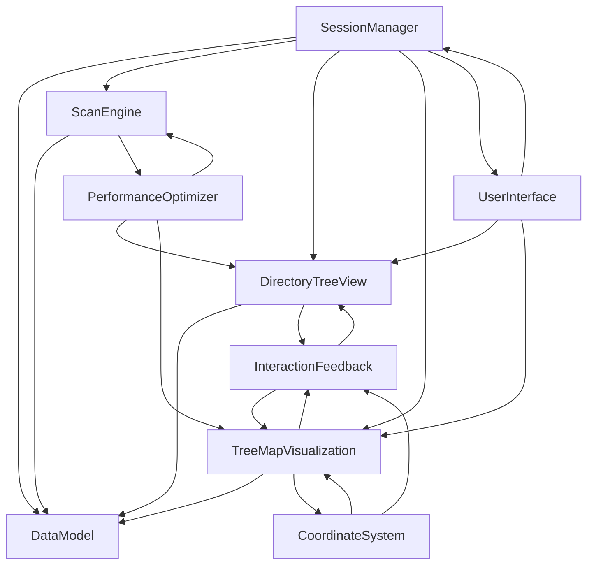
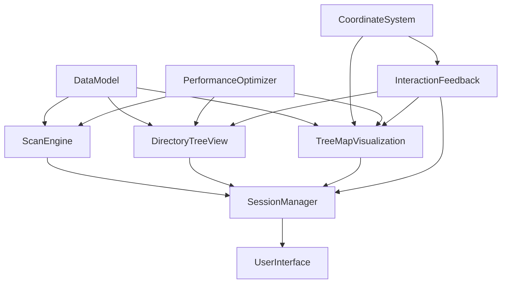

# 模块架构设计 - 磁盘空间分析器

## 概述

基于需求文档中的9个核心特性，将系统划分为以下9个核心模块。每个模块负责特定的功能领域，通过清晰的接口进行交互，确保系统的可维护性和可扩展性。

## 核心模块划分

### 1. 扫描引擎模块 (ScanEngine)
**对应需求特性：** 特性1 - 磁盘扫描和数据采集

**模块简介：**
负责文件系统的高性能扫描，包括异步扫描、进度跟踪、文件过滤和数据采集。实现100ms高频更新机制，支持扫描控制和异步任务管理。

**核心功能：**
- 异步文件系统扫描
- 实时进度更新 (100ms频率)
- 文件过滤 (0KB文件、符号链接、硬链接去重)
- 扫描控制 (开始/暂停/取消)
- 权限错误处理
- 扫描数据完整性保证

**主要组件：**
- `FileSystemScanner` - 核心扫描引擎
- `ScanProgressManager` - 进度管理器
- `FileFilter` - 文件过滤器
- `ScanTaskManager` - 异步任务管理器

### 2. 数据模型模块 (DataModel)
**对应需求特性：** 跨特性基础设施

**模块简介：**
定义系统的核心数据结构，包括文件节点、目录树结构、扫描会话等。提供数据持久化和会话管理功能。

**核心功能：**
- 文件/目录节点数据结构
- 目录树层次结构管理
- 扫描会话数据模型
- 数据持久化和序列化
- 历史会话管理

**主要组件：**
- `FileNode` - 文件/目录节点
- `DirectoryTree` - 目录树结构
- `ScanSession` - 扫描会话
- `DataPersistence` - 数据持久化

### 3. 目录树显示模块 (DirectoryTreeView)
**对应需求特性：** 特性2 - 智能目录树显示

**模块简介：**
实现左侧面板的智能目录树GUI组件，支持Top10显示、智能展开、流畅交互等功能。只显示目录，不显示文件。

**核心功能：**
- 智能目录树渲染 (Top10显示)
- 目录展开/折叠控制
- 实时数据更新显示
- 目录合并显示 ("其他 N个目录")
- 高性能交互 (50ms响应)

**主要组件：**
- `DirectoryTreeViewController` - 目录树控制器
- `SmartDirectoryNode` - 智能目录节点
- `DirectoryMerger` - 目录合并器
- `TreeExpansionManager` - 展开状态管理器

### 4. TreeMap可视化模块 (TreeMapVisualization)
**对应需求特性：** 特性3 - TreeMap可视化系统

**模块简介：**
实现右侧面板的TreeMap可视化系统，使用Squarified算法生成标准矩形拼图布局，支持多行多列网格显示和小文件合并。

**核心功能：**
- Squarified算法实现
- 矩形拼图布局计算
- 颜色系统 (蓝色系文件夹，橙色系文件)
- 小文件合并 (最多4个小文件)
- 平滑动画过渡
- 后台线程计算

**主要组件：**
- `TreeMapLayoutEngine` - 布局引擎
- `SquarifiedAlgorithm` - Squarified算法
- `ColorManager` - 颜色管理器
- `SmallFilesMerger` - 小文件合并器
- `AnimationController` - 动画控制器

### 5. 交互反馈模块 (InteractionFeedback)
**对应需求特性：** 特性4 - TreeMap交互和反馈系统

**模块简介：**
处理TreeMap的所有交互反馈，包括鼠标悬停高亮、智能tooltip、方块选中状态、右键菜单等。确保用户获得流畅的交互体验。

**核心功能：**
- 鼠标悬停高亮效果
- 智能tooltip系统 (跟随鼠标，边缘检测)
- 方块选中状态管理
- 右键上下文菜单 (Finder打开、目录选中)
- 双击文件夹导航
- 交互状态管理

**主要组件：**
- `MouseInteractionHandler` - 鼠标交互处理器
- `TooltipManager` - Tooltip管理器
- `HighlightRenderer` - 高亮渲染器
- `ContextMenuManager` - 右键菜单管理器

### 6. 性能优化模块 (PerformanceOptimizer)
**对应需求特性：** 特性5 - 性能优化和CPU管理

**模块简介：**
负责系统的性能监控和优化，实现CPU智能管理、节流机制、任务调度等。确保系统高效运行，节省系统资源。

**核心功能：**
- CPU使用监控和优化
- 节流机制 (200ms统计更新)
- 任务调度和取消
- 性能指标统计
- 资源使用监控

**主要组件：**
- `CPUOptimizer` - CPU优化器
- `ThrottleManager` - 节流管理器
- `TaskScheduler` - 任务调度器
- `PerformanceMonitor` - 性能监控器

### 7. 坐标系统模块 (CoordinateSystem)
**对应需求特性：** 特性6 - 坐标系统和精确交互

**模块简介：**
实现多层坐标系统，支持HiDPI显示器和多显示器环境，确保鼠标交互精确无偏移。提供调试可视化功能。

**核心功能：**
- 多层坐标系统 (窗口/容器/画布)
- 精确坐标变换
- HiDPI支持
- 多显示器兼容
- 调试可视化系统

**主要组件：**
- `CoordinateTransformer` - 坐标变换器
- `HiDPIManager` - HiDPI管理器
- `MultiDisplayHandler` - 多显示器处理器
- `DebugVisualizer` - 调试可视化器

### 8. 用户界面模块 (UserInterface)
**对应需求特性：** 特性7 - 原生macOS用户界面

**模块简介：**
实现符合macOS设计规范的原生图形用户界面，包括主窗口布局、菜单系统、对话框管理等。提供一致的用户体验和系统集成功能。

**核心功能：**
- 主窗口和分栏布局管理
- 原生macOS菜单栏和工具栏
- 系统对话框和文件选择器
- 深色/浅色模式支持
- 窗口状态管理和恢复
- 系统集成和通知

**主要组件：**
- `MainWindowController` - 主窗口控制器
- `MenuBarManager` - 菜单栏管理器
- `DialogManager` - 对话框管理器
- `ThemeManager` - 主题管理器
- `SystemIntegration` - 系统集成器

### 9. 会话管理模块 (SessionManager)
**对应需求特性：** 特性8 - 会话管理和错误处理

**模块简介：**
管理扫描会话的生命周期，提供错误处理、日志记录、会话持久化等运行时管理功能。确保用户数据安全和系统稳定性。

**核心功能：**
- 扫描会话管理和持久化
- 历史会话存储和恢复
- 错误处理和日志记录
- 自动日志清理
- 进度对话框管理
- 应用程序生命周期管理

**主要组件：**
- `SessionController` - 会话控制器
- `ErrorHandler` - 错误处理器
- `LogManager` - 日志管理器
- `ProgressDialogManager` - 进度对话框管理器
- `AppDelegate` - 应用程序委托


## 模块调用关系

### 主要调用流程



### 详细调用关系

#### 1. 应用启动流程
```
SessionManager → DataModel (会话恢复)
SessionManager → DirectoryTreeView + TreeMapVisualization (界面初始化)
```

#### 2. 扫描执行流程
```
SessionManager → ScanEngine → DataModel
ScanEngine → PerformanceOptimizer (性能监控)
ScanEngine → DirectoryTreeView (实时更新)
DirectoryTreeView → TreeMapVisualization (联动更新)
```

#### 3. 用户交互流程
```
InteractionFeedback → CoordinateSystem (坐标处理)
InteractionFeedback → TreeMapVisualization (方块选中和导航)
InteractionFeedback → DirectoryTreeView (右键菜单选中目录)
DirectoryTreeView → TreeMapVisualization (单向联动，目录树选择更新TreeMap)
```

#### 4. 性能优化流程
```
PerformanceOptimizer → ScanEngine (扫描优化)
PerformanceOptimizer → DirectoryTreeView (UI优化)
PerformanceOptimizer → TreeMapVisualization (渲染优化)
```

#### 5. 数据管理流程
```
DataModel ← ScanEngine (数据写入)
DataModel → DirectoryTreeView (数据读取)
DataModel → TreeMapVisualization (数据读取)
DataModel ↔ SessionManager (会话管理)
```

## 模块依赖关系和编写顺序

### 依赖层次图



### 编写顺序和依赖关系

#### 第1阶段 - 基础设施模块 (无依赖)
**编写顺序：1-3**

1. **data-model** - 核心数据结构模块
   - 无外部依赖
   - 提供基础数据类型和接口
   - 其他所有模块的基础

2. **coordinate-system** - 坐标系统模块
   - 无外部依赖
   - 提供坐标变换基础设施
   - 支持HiDPI和多显示器

3. **performance-optimizer** - 性能优化模块
   - 无外部依赖
   - 提供性能监控和优化基础设施
   - 被多个模块使用

#### 第2阶段 - 核心业务模块 (依赖基础设施)
**编写顺序：4**

4. **scan-engine** - 扫描引擎模块
   - 依赖：DataModel, PerformanceOptimizer
   - 核心业务逻辑模块
   - 提供文件系统扫描功能

#### 第3阶段 - 界面组件模块 (依赖基础设施和数据)
**编写顺序：5-7**

5. **directory-tree-view** - 目录树显示模块
   - 依赖：DataModel, PerformanceOptimizer
   - 左侧目录树界面组件
   - 智能显示和交互功能

6. **treemap-visualization** - TreeMap可视化模块
   - 依赖：DataModel, CoordinateSystem, PerformanceOptimizer
   - 右侧TreeMap界面组件
   - 复杂的可视化算法

7. **interaction-feedback** - 交互反馈模块
   - 依赖：CoordinateSystem, DirectoryTreeView, TreeMapVisualization
   - 处理用户交互和反馈
   - 连接各个界面组件

#### 第4阶段 - 应用管理模块 (依赖所有其他模块)
**编写顺序：8-9**

8. **session-manager** - 会话管理模块
   - 依赖：所有其他模块
   - 应用程序顶层管理
   - 协调各模块协作

9. **user-interface** - 用户界面模块
   - 依赖：DirectoryTreeView, TreeMapVisualization, SessionManager
   - 原生macOS界面管理
   - 窗口和菜单系统
   - 依赖：所有其他模块
   - 应用程序顶层管理
   - 协调各模块协作

### 模块依赖矩阵

| 模块 | DataModel | CoordinateSystem | PerformanceOptimizer | ScanEngine | DirectoryTreeView | TreeMapVisualization | InteractionFeedback | SessionManager |
|------|-----------|------------------|---------------------|------------|-------------------|---------------------|-------------------|----------------|
| ScanEngine | ✓ | - | ✓ | - | - | - | - | - |
| DirectoryTreeView | ✓ | - | ✓ | - | - | - | - | - |
| TreeMapVisualization | ✓ | ✓ | ✓ | - | - | - | - | - |
| InteractionFeedback | - | ✓ | - | - | ✓ | ✓ | - | - |
| SessionManager | ✓ | - | - | ✓ | ✓ | ✓ | ✓ | - |
| UserInterface | - | - | - | - | ✓ | ✓ | - | ✓ |

### 编写建议

#### 并行开发策略
- **第1阶段模块**可以并行开发，无相互依赖
- **第2阶段**需要等待第1阶段完成
- **第3阶段**中，5和6可以并行开发，7需要等待5和6完成
- **第4阶段**需要等待所有其他模块完成

#### 接口优先原则
- 每个模块开发前先定义清晰的接口
- 使用接口进行模块间通信，降低耦合
- 支持模块的独立测试和开发

#### 渐进集成策略
- 按依赖顺序逐步集成模块
- 每个阶段完成后进行集成测试
- 及早发现和解决集成问题

## 接口设计原则

### 1. 单一职责原则
每个模块只负责一个特定的功能领域，避免功能重叠。

### 2. 依赖倒置原则
高层模块不依赖低层模块，都依赖于抽象接口。

### 3. 接口隔离原则
模块间通过最小化的接口进行通信，避免不必要的耦合。

### 4. 开闭原则
模块对扩展开放，对修改封闭，便于功能扩展。

## 关键接口定义

### ScanEngine 接口
```swift
protocol ScanEngineProtocol {
    func startScan(path: String) async
    func cancelScan()
    func pauseScan()
    var scanProgress: Published<ScanProgress> { get }
    var discoveredNodes: Published<[FileNode]> { get }
}
```

### DataModel 接口
```swift
protocol DataModelProtocol {
    func getRootNode() -> FileNode?
    func getChildren(of node: FileNode) -> [FileNode]
    func updateNode(_ node: FileNode)
    func saveSession(_ session: ScanSession)
}
```

### TreeMapVisualization 接口
```swift
protocol TreeMapVisualizationProtocol {
    func updateLayout(for nodes: [FileNode])
    func highlightBlock(at point: CGPoint)
    func selectBlock(at point: CGPoint)
    func navigateToFolder(_ node: FileNode) // 新增：双击导航功能
    func getRect(for node: FileNode) -> CGRect? // 新增：获取方块位置
    var selectedNode: Published<FileNode?> { get }
}
```

### DirectoryTreeView 接口
```swift
protocol DirectoryTreeViewProtocol {
    func expandNode(_ node: FileNode)
    func collapseNode(_ node: FileNode)
    func selectNode(_ node: FileNode)
    func selectAndExpandNode(_ node: FileNode) // 新增：用于右键菜单选中目录
    var selectedNode: Published<FileNode?> { get }
}
```

### UserInterface 接口
```swift
protocol UserInterfaceProtocol {
    func showMainWindow()
    func hideMainWindow()
    func updateWindowTitle(_ title: String)
    func showProgressDialog(for session: ScanSession)
    func hideProgressDialog()
    func showErrorDialog(_ error: AppError)
    func showFileSelectionDialog() -> URL?
    var windowState: Published<WindowState> { get }
}
```

## 总结

该优化后的模块架构设计确保了：

✅ **精简高效** - 9个核心模块，删除价值不大的功能
✅ **清晰的职责分离** - 每个模块专注特定功能领域
✅ **松耦合设计** - 模块间通过最小化接口通信
✅ **高内聚实现** - 相关功能集中在同一模块
✅ **性能优先** - 专门的性能优化模块，避免过度设计
✅ **用户体验** - 专门的交互反馈模块
✅ **聚焦核心** - 专注于核心业务功能，避免不必要的复杂性

### 优化原则

1. **删除过度设计** - 移除了插件系统、数据导出等非核心功能
2. **简化组件** - 每个模块只保留必要的组件，删除冗余功能
3. **专注性能** - 优先考虑应用性能和用户体验
4. **避免功能膨胀** - 严格按照需求文档的9个特性设计
5. **保持简洁** - 架构清晰易懂，便于开发和维护

这种精简的模块化设计为实现需求文档中的9个核心特性提供了坚实的技术基础，确保系统的可维护性、高性能和用户体验，同时避免了过度工程化的问题。