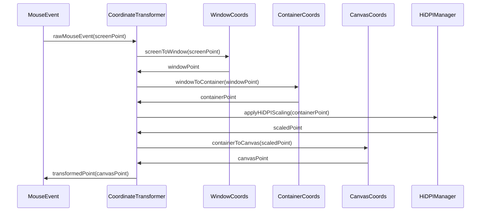
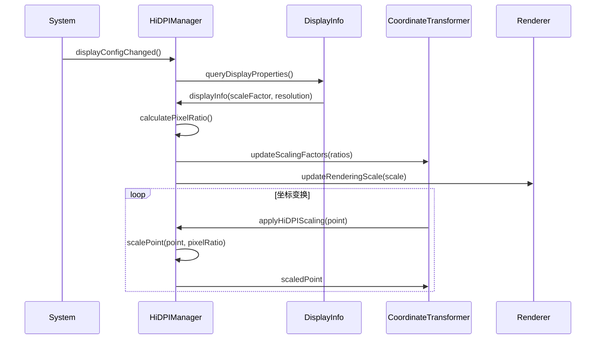
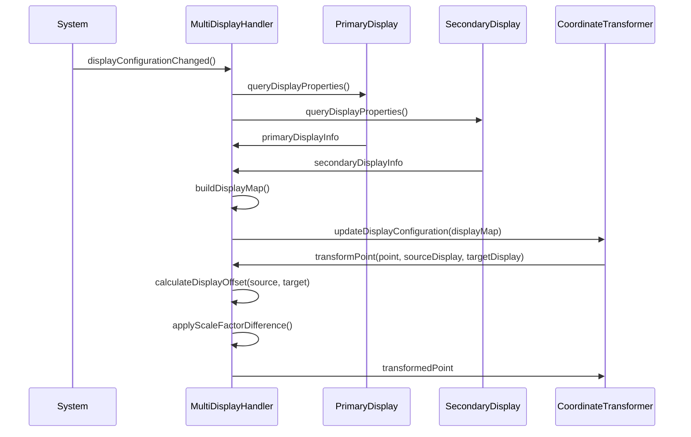
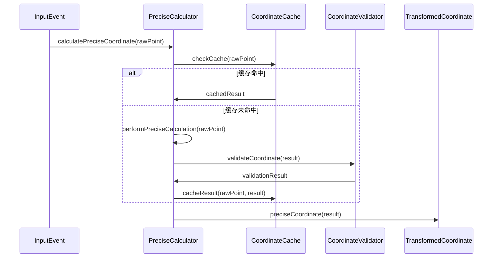
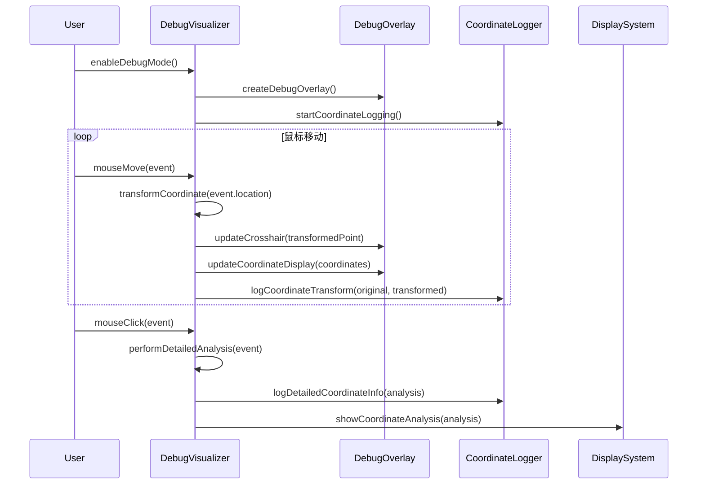

# 模块7：坐标系统模块 (CoordinateSystem) - 处理流程设计

## 模块概述

**模块名称：** CoordinateSystem  
**对应需求特性：** 特性6 - 坐标系统和精确交互  
**核心职责：** 实现多层坐标系统，支持HiDPI显示器和多显示器环境，确保鼠标交互精确无偏移，并提供完整的调试可视化功能

## 核心组件

### 1. CoordinateTransformer - 坐标变换器
**关键逻辑：** 实现多层坐标系统的精确变换，支持窗口、容器、画布坐标的相互转换。使用变换矩阵进行高效计算，缓存频繁使用的变换结果，确保亚像素级的精度。

**实现步骤：**
- 使用CGAffineTransform矩阵实现坐标变换链
- 建立坐标系统层次：屏幕→窗口→容器→画布
- 缓存变换矩阵，避免重复计算相同的变换
- 使用双精度浮点数确保亚像素级精度

### 2. HiDPIManager - HiDPI管理器
**关键逻辑：** 检测和适配HiDPI显示器，自动获取显示器缩放因子并应用到坐标计算。处理非整数缩放比例，确保像素完美对齐，支持动态缩放变化的实时适配。

**实现步骤：**
- 使用NSScreen.main?.backingScaleFactor获取显示器缩放因子
- 监听NSApplication.didChangeScreenParametersNotification处理缩放变化
- 实现像素对齐算法，使用floor/ceil确保整数像素边界
- 支持1.25x、1.5x等非标准缩放比例的精确处理

### 3. MultiDisplayHandler - 多显示器处理器
**关键逻辑：** 管理多显示器环境下的坐标转换，建立显示器配置映射和相对位置关系。处理显示器间的坐标偏移和缩放差异，支持显示器热插拔的动态更新。

**实现步骤：**
- 使用NSScreen.screens枚举所有连接的显示器
- 建立显示器ID到属性的映射表，记录位置和缩放信息
- 计算显示器间的相对偏移量，实现跨屏坐标转换
- 监听显示器配置变化，实时更新坐标变换参数

### 4. DebugVisualizer - 调试可视化器
**关键逻辑：** 提供坐标系统的可视化调试工具，显示鼠标位置十字线和坐标信息面板。记录详细的坐标变换日志，支持交互诊断和问题定位，帮助开发者验证坐标精度。

**实现步骤：**
- 创建透明的NSWindow作为调试覆盖层
- 使用Core Graphics绘制十字线和坐标信息
- 实现坐标变换日志记录，输出每步变换的详细信息
- 提供点击分析功能，显示坐标查找的完整过程

## 主要处理流程

### 流程1：多层坐标系统变换流程



**详细步骤：**
1. **屏幕坐标到窗口坐标**
   - 获取鼠标在屏幕上的绝对坐标
   - 减去窗口在屏幕上的偏移量
   - 考虑窗口标题栏和边框
   - 处理窗口最小化和全屏状态

2. **窗口坐标到容器坐标**
   - 减去窗口内容区域的偏移
   - 考虑工具栏和状态栏占用空间
   - 处理分割视图的布局影响
   - 应用容器的内边距

3. **HiDPI缩放处理**
   - 获取当前显示器的缩放因子 - 查询NSScreen的backingScaleFactor属性
   - 应用像素密度缩放 - 将逻辑坐标乘以缩放因子转换为物理像素
   - 处理非整数缩放比例 - 支持1.25x、1.5x等非标准缩放比例
   - 确保像素级精确对齐 - 使用floor/ceil函数对齐到像素边界

4. **容器坐标到画布坐标**
   - 应用画布的滚动偏移 - 减去滚动视图的contentOffset值
   - 考虑画布的缩放变换 - 应用用户缩放级别的变换矩阵
   - 处理画布的旋转变换 - 应用旋转角度的坐标变换
   - 应用自定义坐标系变换 - 处理翻转、镜像等特殊变换

### 流程2：HiDPI显示器支持流程



**详细步骤：**
1. **显示器属性检测**
   - 查询显示器的物理分辨率
   - 获取系统设置的缩放因子
   - 检测显示器的像素密度
   - 识别Retina显示器类型

2. **像素比例计算**
   - 计算逻辑像素到物理像素的比例
   - 处理非标准缩放比例 (如1.25x, 1.5x)
   - 考虑系统级别的缩放设置
   - 支持动态缩放变化

3. **坐标缩放应用**
   - 将逻辑坐标转换为物理像素坐标
   - 确保坐标变换的可逆性
   - 处理浮点坐标的舍入问题
   - 维护坐标精度

4. **渲染缩放同步**
   - 同步更新渲染引擎的缩放设置
   - 调整字体和图像的渲染尺寸
   - 确保UI元素的清晰度
   - 优化渲染性能

### 流程3：多显示器环境处理流程



**详细步骤：**
1. **显示器配置检测**
   - 枚举所有连接的显示器
   - 获取每个显示器的位置和尺寸
   - 识别主显示器和扩展显示器
   - 检测显示器的排列方式

2. **显示器映射构建**
   - 建立显示器ID到属性的映射
   - 计算显示器间的相对位置
   - 处理显示器的重叠区域
   - 维护显示器配置的一致性

3. **跨显示器坐标变换**
   - 计算不同显示器间的坐标偏移
   - 处理不同显示器的缩放差异
   - 确保坐标变换的连续性
   - 处理显示器边界的特殊情况

4. **动态配置更新**
   - 监听显示器配置变化事件
   - 实时更新坐标变换参数
   - 处理显示器热插拔
   - 保持应用状态的一致性

### 流程4：精确坐标计算流程



**详细步骤：**
1. **高精度计算**
   - 使用双精度浮点数进行计算
   - 避免累积舍入误差
   - 实现亚像素级精度
   - 处理极小的坐标差异

2. **坐标缓存机制**
   - 缓存频繁使用的坐标变换结果
   - 使用LRU策略管理缓存
   - 处理缓存失效和更新
   - 优化缓存命中率

3. **坐标验证**
   - 验证坐标的合理性和有效性
   - 检测坐标变换的异常情况
   - 处理边界条件和特殊值
   - 确保坐标的一致性

4. **误差控制**
   - 设置合理的误差容忍度
   - 实现误差补偿机制
   - 监控累积误差
   - 定期校准坐标系统

### 流程5：调试可视化系统流程



**详细步骤：**
1. **调试界面创建**
   - 创建透明的调试覆盖层
   - 设置调试信息显示面板
   - 配置坐标跟踪十字线
   - 初始化日志记录系统

2. **实时坐标跟踪**
   - 显示鼠标位置的十字线
   - 实时更新坐标信息面板
   - 显示多层坐标系的对应值
   - 提供坐标变换的可视化

3. **详细分析模式**
   - 点击时输出详细的坐标分析
   - 显示坐标变换的每个步骤
   - 记录变换矩阵和参数
   - 提供坐标验证信息

4. **调试数据记录**
   - 记录坐标变换的历史数据
   - 保存异常坐标的详细信息
   - 生成坐标系统的诊断报告
   - 支持调试数据的导出和分析


## 性能优化策略

### 1. 坐标变换优化
- 缓存频繁使用的变换结果
- 使用矩阵运算优化多重变换
- 实现增量变换减少计算量
- 优化浮点运算精度和性能

### 2. HiDPI处理优化
- 缓存显示器属性避免重复查询
- 使用整数运算优化缩放计算
- 实现智能的像素对齐
- 优化高分辨率下的渲染性能

### 3. 多显示器优化
- 建立高效的显示器查找索引
- 缓存跨显示器的变换矩阵
- 优化显示器配置变化的处理
- 减少不必要的坐标重计算

### 4. 调试模式优化
- 使用异步更新避免阻塞主线程
- 实现调试信息的延迟渲染
- 优化调试覆盖层的性能影响
- 提供调试模式的性能监控

## 接口定义

```swift
protocol CoordinateSystemProtocol {
    // 坐标变换
    func transformToCanvas(_ screenPoint: CGPoint) -> CGPoint
    func transformToScreen(_ canvasPoint: CGPoint) -> CGPoint
    func transformBetweenDisplays(_ point: CGPoint, from: CGDirectDisplayID, to: CGDirectDisplayID) -> CGPoint
    
    // 配置管理
    func updateDisplayConfiguration()
    func setContainerBounds(_ bounds: CGRect)
    func setCanvasBounds(_ bounds: CGRect)
    
    // HiDPI支持
    func getScaleFactor() -> CGFloat
    func getScaleFactor(for display: CGDirectDisplayID) -> CGFloat
    func scalePoint(_ point: CGPoint) -> CGPoint
    func unscalePoint(_ point: CGPoint) -> CGPoint
    
    // 调试功能
    func enableDebugMode()
    func disableDebugMode()
    func logCoordinateTransform(_ original: CGPoint, _ transformed: CGPoint)
    var debugInfo: Published<CoordinateDebugInfo> { get }
}

struct CoordinateDebugInfo {
    let originalPoint: CGPoint
    let transformedPoint: CGPoint
    let scaleFactor: CGFloat
    let displayID: CGDirectDisplayID
    let transformationSteps: [TransformationStep]
}

struct TransformationStep {
    let name: String
    let inputPoint: CGPoint
    let outputPoint: CGPoint
    let parameters: [String: Any]
}
```

## 测试策略

### 1. 精度测试
- 坐标变换精度验证
- 累积误差测试
- 边界条件测试
- 数值稳定性测试

### 2. 兼容性测试
- 不同分辨率显示器测试
- 多显示器配置测试
- HiDPI显示器兼容性测试
- 系统缩放设置测试

### 3. 性能测试
- 坐标变换性能基准
- 大量坐标处理性能
- 内存使用效率测试
- 实时性能监控

### 4. 调试功能测试
- 调试可视化准确性测试
- 调试信息完整性测试
- 调试模式性能影响测试
- 调试数据记录测试

## 监控指标

### 1. 精度指标
- 坐标变换精度
- 累积误差大小
- 像素对齐准确性
- 变换一致性

### 2. 性能指标
- 坐标变换延迟
- 缓存命中率
- 内存使用量
- CPU使用率

### 3. 兼容性指标
- 显示器支持覆盖率
- HiDPI兼容性
- 多显示器稳定性
- 系统集成度

### 4. 调试效果指标
- 调试信息准确性
- 问题定位效率
- 调试工具使用率
- 开发效率提升