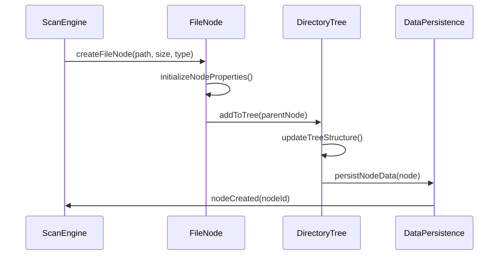
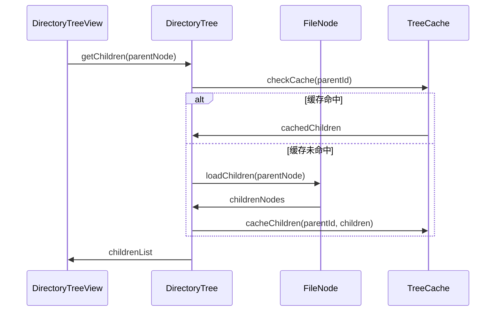
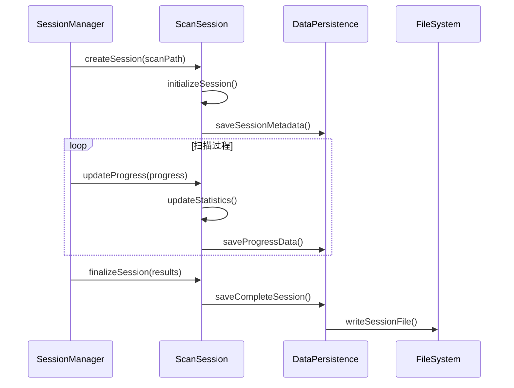
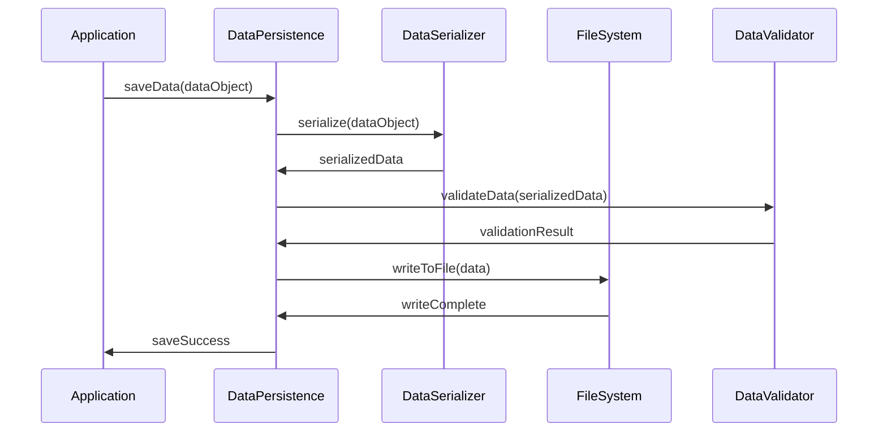

# 模块1：数据模型模块 (DataModel) - 处理流程设计

## 模块概述

**模块名称：** DataModel  
**对应需求特性：** 跨特性基础设施  
**核心职责：** 定义系统的核心数据结构，包括文件节点、目录树结构、扫描会话等。提供数据持久化和会话管理功能

## 核心组件

### 1. FileNode - 文件/目录节点
**关键逻辑：** 使用UUID作为唯一标识，维护父子关系的双向指针，支持弱引用避免循环依赖。实现递归大小计算和路径构建，提供线程安全的属性访问。

**实现步骤：**
- 节点创建时生成UUID并初始化基本属性
- 建立父子关系时使用弱引用避免内存泄漏
- 递归计算totalSize时缓存结果避免重复计算
- 路径构建通过向上遍历父节点链构造完整路径

### 2. DirectoryTree - 目录树结构
**关键逻辑：** 实现树状数据结构的增删改查，支持深度优先和广度优先遍历。维护路径到节点的哈希索引，提供O(1)的快速查找。支持子树的批量操作和增量更新。

**实现步骤：**
- 使用Dictionary维护路径到节点的映射索引
- 插入节点时同时更新父节点的children数组和路径索引
- 删除节点时递归清理子节点并更新索引
- 遍历时使用栈或队列实现深度/广度优先算法

### 3. ScanSession - 扫描会话
**关键逻辑：** 记录扫描的完整生命周期状态，包括进度、统计信息和错误记录。支持会话的暂停恢复，维护扫描断点信息。实现会话数据的增量更新和状态同步。

**实现步骤：**
- 创建会话时记录开始时间和扫描路径
- 进度更新时计算百分比和预估剩余时间
- 暂停时保存当前扫描位置和已处理文件列表
- 恢复时从断点继续，跳过已处理的文件

### 4. DataPersistence - 数据持久化
**关键逻辑：** 使用JSON格式进行数据序列化，支持数据压缩和版本兼容性处理。实现原子写入操作防止数据损坏，提供数据完整性验证和自动修复机制。

**实现步骤：**
- 序列化时处理循环引用，使用节点ID替代对象引用
- 写入时先写临时文件，成功后原子性重命名
- 读取时验证JSON格式和数据完整性
- 版本不兼容时提供数据迁移和降级处理

## 依赖关系

- **依赖模块**: 无 (基础设施模块)
- **被依赖模块**: ScanEngine, DirectoryTreeView, TreeMapVisualization, SessionManager

## 主要处理流程

### 流程1：文件节点数据结构管理流程



**详细步骤：**
1. **节点创建**
   - 根据文件路径创建节点 - 解析路径字符串，提取文件名和目录信息
   - 设置节点基本属性 (名称、大小、类型) - 从文件系统API获取元数据信息
   - 计算节点唯一标识符 - 使用UUID生成器创建全局唯一ID
   - 初始化节点状态 - 设置默认值，建立内存结构

2. **属性管理**
   - 文件大小和占用空间 - 区分逻辑大小和物理占用，处理稀疏文件
   - 创建和修改时间 - 从文件系统获取时间戳，转换为标准格式
   - 文件权限和属性 - 读取POSIX权限位，处理扩展属性
   - 节点层级和深度 - 递归计算从根节点的距离，维护深度索引

3. **关系维护**
   - 父子节点关系 - 使用双向指针建立关系，父节点用弱引用避免循环
   - 兄弟节点排序 - 按名称或大小排序，维护有序列表
   - 树状结构完整性 - 验证父子关系一致性，检测孤立节点
   - 路径索引管理 - 建立路径到节点的哈希映射，支持快速查找

4. **数据持久化**
   - 节点数据序列化 - 转换为JSON格式，处理循环引用问题
   - 增量数据更新 - 只保存变化的节点，减少I/O开销
   - 数据完整性验证 - 使用校验和验证数据完整性，检测损坏
   - 存储空间优化 - 压缩重复数据，使用引用共享相同内容

### 流程2：目录树结构管理流程



**详细步骤：**
1. **树结构构建**
   - 根节点初始化
   - 子节点动态加载
   - 树深度控制
   - 分支平衡优化

2. **节点查询**
   - 按路径查找节点
   - 按大小排序节点
   - 按类型过滤节点
   - 快速索引查询

3. **缓存管理**
   - 热点数据缓存
   - LRU缓存策略
   - 缓存失效处理
   - 内存使用优化

4. **树操作**
   - 节点插入和删除
   - 子树移动和重组
   - 树结构验证
   - 并发访问控制

### 流程3：扫描会话管理流程



**详细步骤：**
1. **会话创建**
   - 生成会话唯一ID
   - 设置扫描参数
   - 初始化统计数据
   - 记录开始时间

2. **进度跟踪**
   - 扫描进度百分比
   - 已处理文件数量
   - 当前扫描路径
   - 预估剩余时间

3. **统计数据**
   - 总文件数和大小
   - 目录层级统计
   - 文件类型分布
   - 扫描性能指标

4. **会话持久化**
   - 会话元数据保存
   - 扫描结果序列化
   - 历史会话管理
   - 数据压缩存储

### 流程4：数据持久化流程



**详细步骤：**
1. **数据序列化**
   - 对象到JSON转换
   - 二进制数据编码
   - 压缩算法应用
   - 版本兼容性处理

2. **数据验证**
   - 数据完整性检查
   - 格式规范验证
   - 关系一致性验证
   - 错误数据修复

3. **文件操作**
   - 原子写入操作
   - 备份文件创建
   - 文件锁定机制
   - 错误恢复处理

4. **存储优化**
   - 增量保存策略
   - 数据去重处理
   - 存储空间管理
   - 清理过期数据

## 数据结构设计

### FileNode 数据结构
```swift
struct FileNode {
    let id: UUID
    let name: String
    let path: String
    let size: Int64
    let isDirectory: Bool
    let createdDate: Date
    let modifiedDate: Date
    let permissions: FilePermissions
    var children: [FileNode]?
    weak var parent: FileNode?
    
    // 计算属性
    var totalSize: Int64 { /* 递归计算子节点总大小 */ }
    var depth: Int { /* 计算节点在树中的深度 */ }
    var childCount: Int { /* 子节点数量 */ }
}
```

### ScanSession 数据结构
```swift
struct ScanSession {
    let id: UUID
    let scanPath: String
    let startTime: Date
    var endTime: Date?
    var status: ScanStatus
    var progress: ScanProgress
    var statistics: ScanStatistics
    var rootNode: FileNode?
    
    enum ScanStatus {
        case running
        case completed
        case cancelled
        case error(Error)
    }
}
```

### ScanProgress 数据结构
```swift
struct ScanProgress {
    var percentage: Double
    var processedFiles: Int
    var totalFiles: Int?
    var currentPath: String
    var bytesProcessed: Int64
    var estimatedTimeRemaining: TimeInterval?
}
```

## 性能优化策略

### 1. 内存管理优化
- 使用弱引用避免循环引用
- 实现节点的延迟加载
- 优化大对象的内存占用
- 及时释放不使用的数据

### 2. 数据访问优化
- 建立高效的索引结构
- 使用缓存减少重复计算
- 实现数据的批量操作
- 优化查询算法复杂度

### 3. 存储优化
- 使用压缩算法减少存储空间
- 实现增量保存机制
- 优化文件I/O操作
- 管理存储空间使用

### 4. 并发安全
- 使用读写锁保护数据
- 实现线程安全的数据结构
- 避免数据竞争条件
- 优化并发访问性能

## 接口定义

```swift
protocol DataModelProtocol {
    // 节点管理
    func createFileNode(path: String, size: Int64, isDirectory: Bool) -> FileNode
    func getNode(by id: UUID) -> FileNode?
    func getChildren(of node: FileNode) -> [FileNode]
    func updateNode(_ node: FileNode)
    func deleteNode(_ node: FileNode)
    
    // 树操作
    func getRootNode() -> FileNode?
    func findNode(at path: String) -> FileNode?
    func getNodesBySize(limit: Int) -> [FileNode]
    func getNodesByType(_ type: FileType) -> [FileNode]
    
    // 会话管理
    func createSession(scanPath: String) -> ScanSession
    func saveSession(_ session: ScanSession)
    func loadSession(_ sessionId: UUID) -> ScanSession?
    func getAllSessions() -> [ScanSession]
    func deleteSession(_ sessionId: UUID)
    
    // 数据持久化
    func saveData() async throws
    func loadData() async throws
    func exportData(format: ExportFormat) -> Data
    func importData(_ data: Data) throws
}

protocol DataPersistenceProtocol {
    func save<T: Codable>(_ object: T, to path: String) throws
    func load<T: Codable>(_ type: T.Type, from path: String) throws -> T
    func delete(at path: String) throws
    func exists(at path: String) -> Bool
}
```

## 测试策略

### 1. 单元测试
- 节点创建和属性测试
- 树结构操作测试
- 数据序列化测试
- 缓存机制测试

### 2. 集成测试
- 模块间数据传递测试
- 并发访问安全测试
- 大数据量处理测试
- 错误恢复测试

### 3. 性能测试
- 大文件树处理性能
- 内存使用效率测试
- 数据访问速度测试
- 存储I/O性能测试

### 4. 数据完整性测试
- 数据一致性验证
- 序列化往返测试
- 错误数据处理测试
- 版本兼容性测试

## 监控指标

### 1. 性能指标
- 节点创建速度
- 数据查询响应时间
- 内存使用量
- 存储空间占用

### 2. 数据质量指标
- 数据完整性
- 序列化成功率
- 缓存命中率
- 错误恢复成功率

### 3. 系统稳定性指标
- 内存泄漏检测
- 并发安全性
- 数据一致性
- 异常处理覆盖率