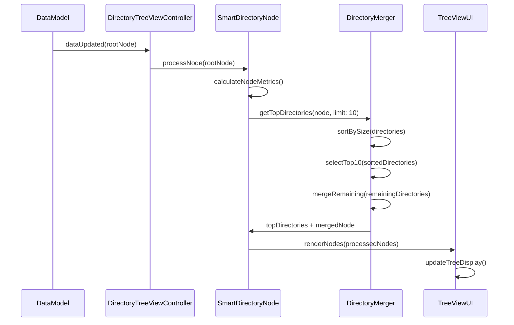
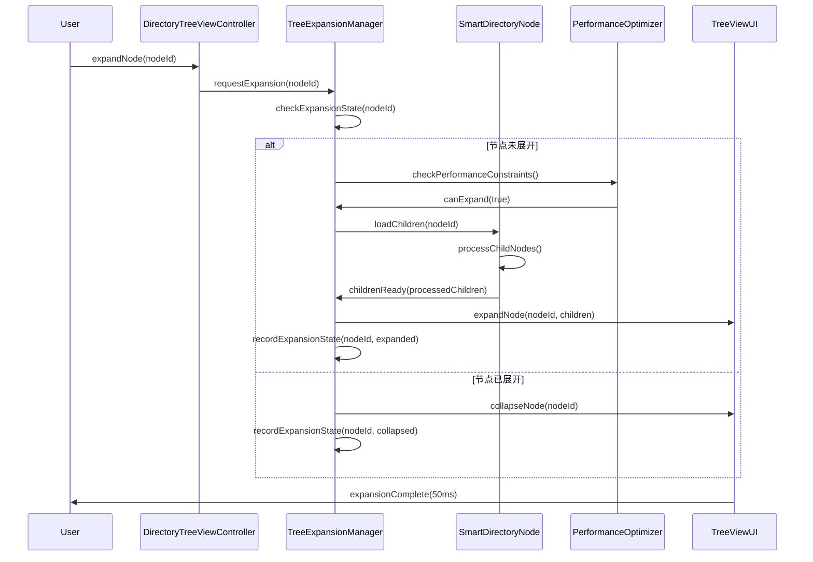
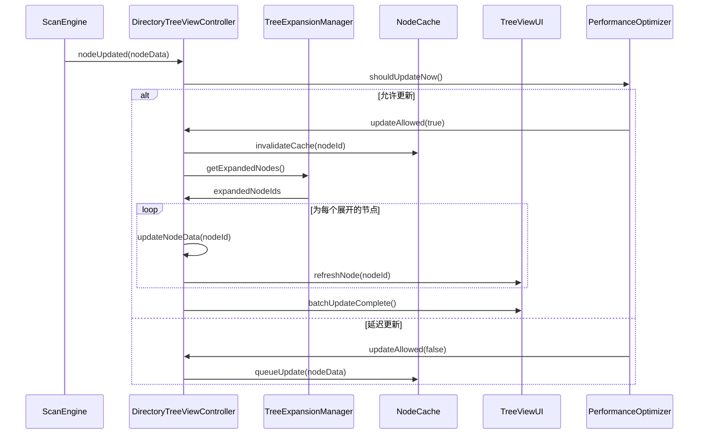
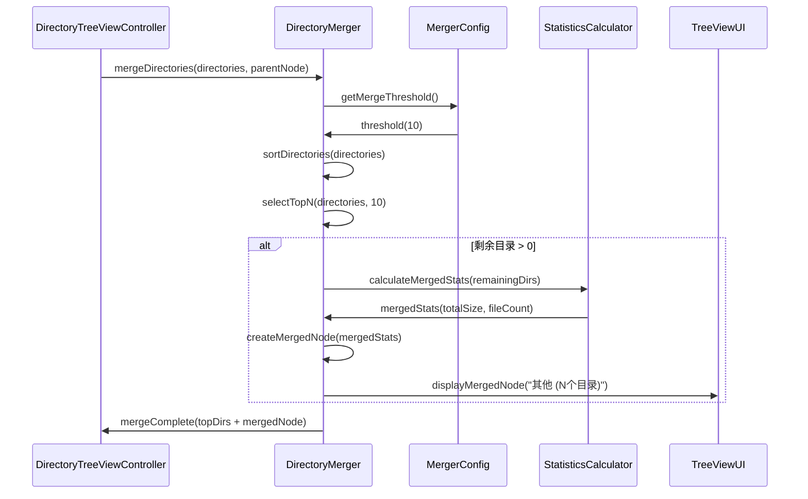
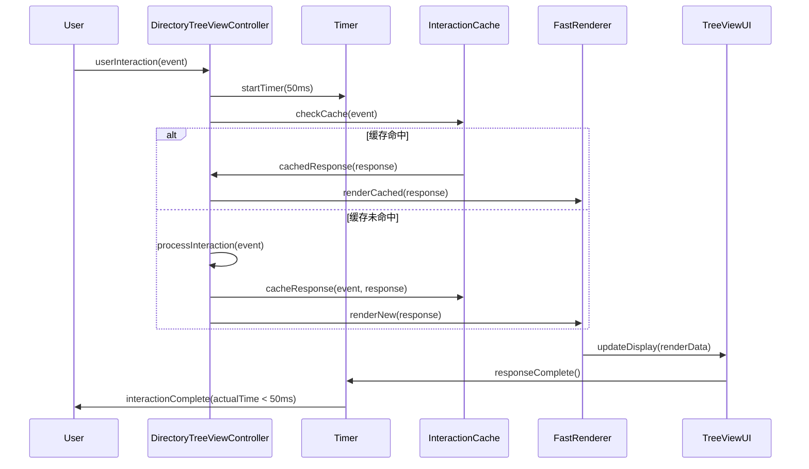

# 模块4：目录树显示模块 (DirectoryTreeView) - 处理流程设计

## 模块概述

**模块名称：** DirectoryTreeView  
**对应需求特性：** 特性2 - 智能目录树显示  
**核心职责：** 实现左侧面板的智能目录树GUI组件，支持Top10显示、智能展开、流畅交互等功能。只显示目录，不显示文件

## 核心组件

### 1. DirectoryTreeViewController - 目录树控制器
**关键逻辑：** 协调目录树的渲染和交互，管理数据更新和界面同步。实现虚拟化滚动技术处理大量节点，使用增量渲染减少重绘开销，确保50ms内的交互响应时间。

**实现步骤：**
- 使用NSOutlineView实现虚拟化滚动，只渲染可见节点
- 维护节点展开状态的字典，快速查询和更新状态
- 实现增量数据源更新，只刷新变化的节点行
- 使用DispatchQueue.main.async确保UI更新在主线程执行

### 2. SmartDirectoryNode - 智能目录节点
**关键逻辑：** 封装目录的显示逻辑和统计计算，支持懒加载和异步数据更新。实现节点的缓存机制和状态管理，提供格式化的大小显示和百分比计算。

**实现步骤：**
- 使用@Published属性包装器实现响应式数据更新
- 懒加载children属性，首次访问时才计算子节点
- 缓存计算结果如totalSize和percentageOfParent避免重复计算
- 使用ByteCountFormatter格式化文件大小显示

### 3. DirectoryMerger - 目录合并器
**关键逻辑：** 实现Top10算法，按大小排序选择前10个目录，将剩余目录合并为"其他(N个目录)"节点。支持合并节点的展开查看，维护合并统计的准确性。

**实现步骤：**
- 使用sorted(by:)按目录大小降序排序
- 取前10个目录作为显示项，剩余目录创建合并节点
- 合并节点计算总大小和文件数，生成显示名称
- 支持合并节点展开，显示被合并的具体目录列表

### 4. TreeExpansionManager - 展开状态管理器
**关键逻辑：** 管理节点的展开/折叠状态，维护展开历史和最大展开数限制。实现状态持久化和恢复，支持批量展开操作和状态同步。

**实现步骤：**
- 使用Set<UUID>存储已展开节点的ID集合
- 维护展开历史数组，支持LRU策略限制最大展开数
- 实现状态序列化，保存到UserDefaults实现持久化
- 批量展开时使用beginUpdates/endUpdates优化性能

## 依赖关系

- **依赖模块**: DataModel, PerformanceOptimizer
- **被依赖模块**: InteractionFeedback, SessionManager

## 主要处理流程

### 流程1：智能目录树渲染流程 (Top10显示)



**详细步骤：**
1. **目录数据预处理**
   - 过滤掉文件，只保留目录 - 遍历子节点，使用isDirectory标志筛选目录
   - 计算每个目录的总大小 - 递归累加目录下所有文件的大小
   - 统计子目录和文件数量 - 分别计算直接子目录数和总文件数
   - 计算占用百分比 - 相对于父目录总大小计算占用比例

2. **Top10选择算法**
   - 按目录大小降序排序 - 使用快速排序算法，以总大小为排序键
   - 选择前10个最大的目录 - 取排序后的前10个元素作为显示项
   - 处理大小相同的目录排序 - 大小相同时按名称字母顺序排序
   - 确保选择结果稳定 - 使用稳定排序算法，保证结果一致性

3. **剩余目录合并**
   - 将第11个及以后的目录合并 - 收集排序后第11位开始的所有目录
   - 创建"其他 (N个目录)"节点 - 生成虚拟合并节点，显示合并数量
   - 计算合并节点的总大小 - 累加所有合并目录的大小和文件数
   - 保持合并节点的可展开性 - 支持展开查看被合并的具体目录

4. **节点显示信息**
   - 目录图标和名称 - 使用系统目录图标，显示目录名称
   - 文件数量统计 - 格式化显示文件数量，如"1,234个文件"
   - 总大小格式化显示 - 使用合适单位显示大小，如"1.2 GB"
   - 占用百分比计算 - 显示相对于父目录的占用百分比

### 流程2：目录展开/折叠控制流程



**详细步骤：**
1. **展开状态检查**
   - 查询节点当前展开状态
   - 检查是否有缓存的子节点
   - 验证节点展开权限
   - 处理展开状态冲突

2. **性能约束检查**
   - 检查当前系统负载
   - 限制同时展开的节点数量
   - 评估展开操作的性能影响
   - 决定是否允许展开

3. **子节点加载**
   - 异步加载子目录数据
   - 应用Top10过滤规则
   - 创建智能目录节点
   - 缓存加载结果

4. **界面更新**
   - 在50ms内完成展开动画
   - 更新树状结构显示
   - 调整滚动位置
   - 保持用户焦点

### 流程3：实时数据更新显示流程



**详细步骤：**
1. **更新触发机制**
   - 监听扫描引擎的数据更新
   - 接收增量数据变化通知
   - 处理批量数据更新
   - 管理更新优先级

2. **更新频率控制**
   - 与性能优化器协调更新频率
   - 避免过度频繁的界面刷新
   - 批量处理多个更新请求
   - 保持界面响应性

3. **缓存失效管理**
   - 识别需要更新的节点
   - 清除过期的缓存数据
   - 重新计算节点统计信息
   - 更新父节点的聚合数据

4. **增量界面更新**
   - 只更新变化的节点
   - 保持展开状态不变
   - 平滑更新动画效果
   - 避免界面闪烁

### 流程4：目录合并显示流程



**详细步骤：**
1. **合并阈值配置**
   - 设置Top10显示限制
   - 支持动态调整阈值
   - 考虑屏幕空间限制
   - 平衡显示效果和性能

2. **目录排序策略**
   - 主要按目录大小排序
   - 次要按文件数量排序
   - 处理大小相同的情况
   - 保持排序结果稳定

3. **合并节点创建**
   - 计算合并目录的总统计
   - 生成合适的显示名称
   - 创建虚拟合并节点
   - 支持合并节点展开

4. **合并节点交互**
   - 支持展开查看合并的目录
   - 提供合并详情tooltip
   - 处理合并节点的选中
   - 与TreeMap视图联动

### 流程5：高性能交互流程 (50ms响应)



**详细步骤：**
1. **响应时间监控**
   - 为每个交互设置50ms目标
   - 监控实际响应时间
   - 记录性能统计数据
   - 识别性能瓶颈

2. **交互缓存策略**
   - 缓存常见交互的结果
   - 预计算可能的交互响应
   - 使用LRU策略管理缓存
   - 定期清理过期缓存

3. **快速渲染优化**
   - 使用增量渲染技术
   - 优化绘制算法
   - 减少不必要的重绘
   - 利用硬件加速

4. **性能降级策略**
   - 在性能不足时简化显示
   - 延迟非关键的更新
   - 减少动画效果
   - 保证核心功能响应

## 数据结构设计

### SmartDirectoryNode 结构
```swift
class SmartDirectoryNode: ObservableObject {
    let id: UUID
    let name: String
    let path: String
    let size: Int64
    let fileCount: Int
    let directoryCount: Int
    let lastModified: Date
    
    @Published var isExpanded: Bool = false
    @Published var children: [SmartDirectoryNode] = []
    @Published var isLoading: Bool = false
    
    weak var parent: SmartDirectoryNode?
    
    // 计算属性
    var sizeFormatted: String { /* 格式化大小显示 */ }
    var percentageOfParent: Double { /* 计算占父目录的百分比 */ }
    var displayName: String { /* 生成显示名称 */ }
    var icon: String { /* 获取目录图标 */ }
    
    // 智能功能
    func loadChildrenAsync() async { /* 异步加载子目录 */ }
    func calculateStatistics() { /* 计算统计信息 */ }
    func shouldMergeChildren() -> Bool { /* 判断是否需要合并子目录 */ }
}
```

### TreeExpansionState 结构
```swift
struct TreeExpansionState {
    private var expandedNodes: Set<UUID> = []
    private var expansionHistory: [UUID] = []
    private var maxExpandedNodes: Int = 50
    
    mutating func expand(_ nodeId: UUID) {
        expandedNodes.insert(nodeId)
        expansionHistory.append(nodeId)
        enforceMaxExpansion()
    }
    
    mutating func collapse(_ nodeId: UUID) {
        expandedNodes.remove(nodeId)
        expansionHistory.removeAll { $0 == nodeId }
    }
    
    func isExpanded(_ nodeId: UUID) -> Bool {
        return expandedNodes.contains(nodeId)
    }
    
    private mutating func enforceMaxExpansion() {
        while expandedNodes.count > maxExpandedNodes {
            if let oldestNode = expansionHistory.first {
                collapse(oldestNode)
            }
        }
    }
}
```

## 性能优化策略

### 1. 渲染优化
- 使用虚拟化技术处理大量节点
- 实现增量渲染减少重绘
- 缓存渲染结果避免重复计算
- 优化滚动性能

### 2. 数据加载优化
- 实现懒加载减少初始加载时间
- 使用异步加载避免阻塞界面
- 缓存加载结果提高响应速度
- 预加载可能访问的数据

### 3. 内存管理优化
- 及时释放不可见节点的资源
- 使用弱引用避免循环引用
- 实现节点对象池管理
- 控制缓存大小避免内存溢出

### 4. 交互响应优化
- 优化事件处理算法
- 使用防抖技术避免过度响应
- 实现交互预测和预处理
- 保证50ms响应时间目标

## 接口定义

```swift
protocol DirectoryTreeViewProtocol {
    // 节点管理
    func loadRootNode(_ node: FileNode)
    func refreshNode(_ nodeId: UUID)
    func expandNode(_ nodeId: UUID)
    func collapseNode(_ nodeId: UUID)
    func selectNode(_ nodeId: UUID)
    
    // 数据查询
    func getSelectedNode() -> SmartDirectoryNode?
    func getExpandedNodes() -> [UUID]
    func findNode(by path: String) -> SmartDirectoryNode?
    
    // 显示控制
    func setDisplayMode(_ mode: TreeDisplayMode)
    func setSortOrder(_ order: SortOrder)
    func setMergeThreshold(_ threshold: Int)
    
    // 事件发布
    var selectedNode: Published<SmartDirectoryNode?> { get }
    var expandedNodes: Published<Set<UUID>> { get }
    var isLoading: Published<Bool> { get }
    
    // 性能监控
    func getPerformanceMetrics() -> TreePerformanceMetrics
    func resetPerformanceCounters()
}

protocol DirectoryMergerProtocol {
    func mergeDirectories(_ directories: [SmartDirectoryNode], threshold: Int) -> [SmartDirectoryNode]
    func createMergedNode(from directories: [SmartDirectoryNode]) -> SmartDirectoryNode
    func shouldMerge(_ directories: [SmartDirectoryNode], threshold: Int) -> Bool
}

enum TreeDisplayMode {
    case compact
    case detailed
    case minimal
}

enum SortOrder {
    case size
    case name
    case fileCount
    case lastModified
}

struct TreePerformanceMetrics {
    let averageResponseTime: TimeInterval
    let cacheHitRate: Double
    let renderFrameRate: Double
    let memoryUsage: Int64
    let nodeCount: Int
}
```

## 测试策略

### 1. 功能测试
- 目录树显示正确性测试
- Top10过滤算法测试
- 展开/折叠功能测试
- 合并节点功能测试

### 2. 性能测试
- 50ms响应时间测试
- 大量节点渲染性能测试
- 内存使用效率测试
- 滚动流畅度测试

### 3. 交互测试
- 鼠标点击响应测试
- 键盘导航测试
- 拖拽操作测试
- 多选功能测试

### 4. 数据一致性测试
- 实时更新准确性测试
- 缓存一致性测试
- 状态同步测试
- 错误恢复测试

## 监控指标

### 1. 性能指标
- 节点渲染时间
- 交互响应时间
- 内存使用量
- 缓存命中率

### 2. 用户体验指标
- 操作流畅度
- 数据加载速度
- 界面响应性
- 错误处理效果

### 3. 功能指标
- 显示准确性
- 过滤正确性
- 状态一致性
- 数据完整性