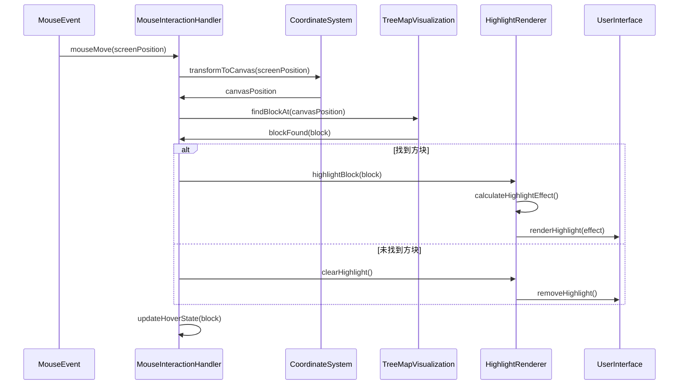
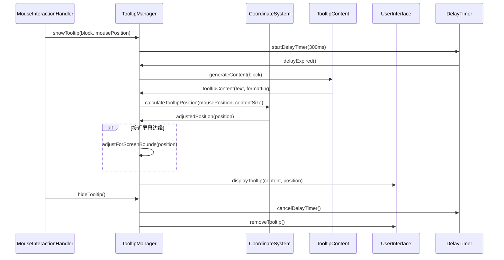
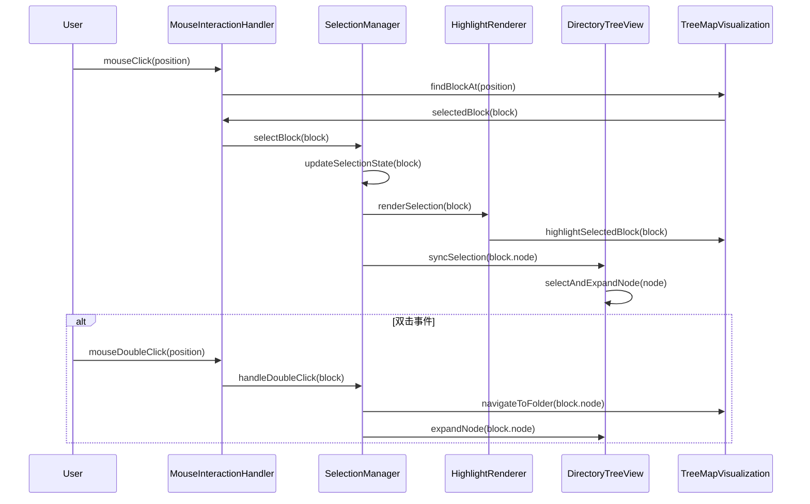
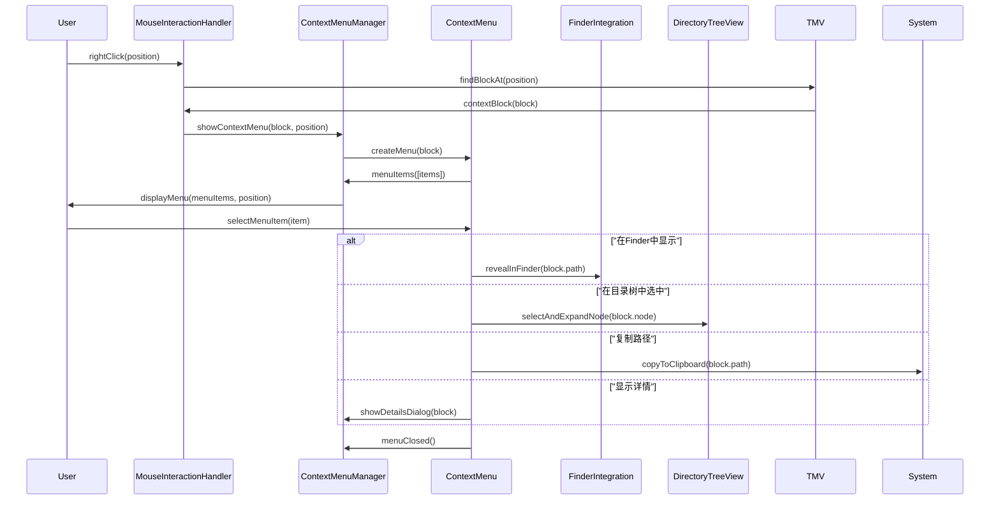
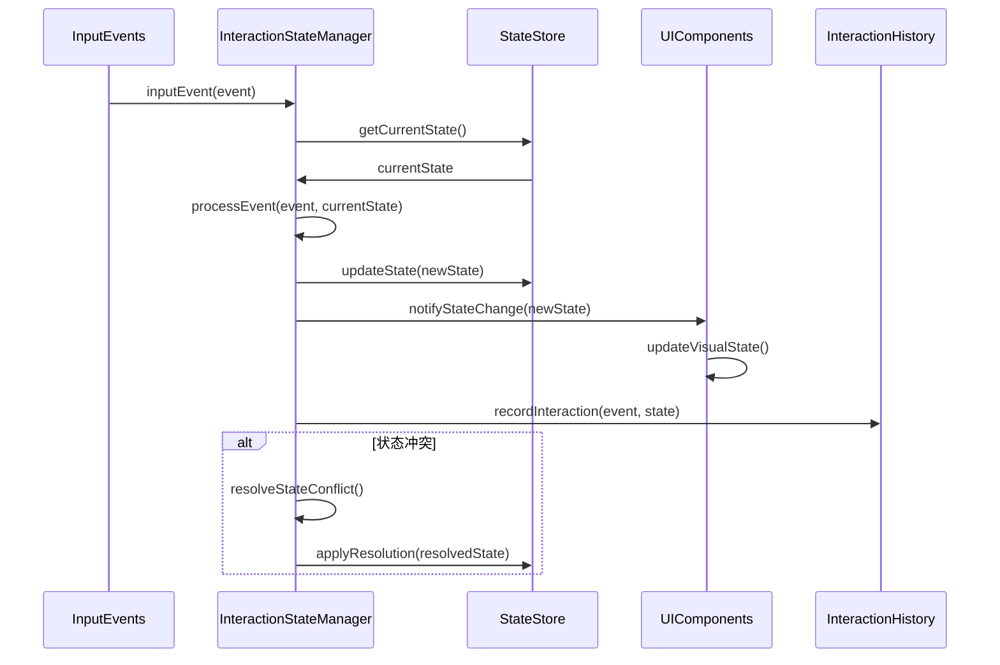

# 模块5：交互反馈模块 (InteractionFeedback) - 处理流程设计

## 模块概述

**模块名称：** InteractionFeedback  
**对应需求特性：** 特性4 - TreeMap交互和反馈系统  
**核心职责：** 处理TreeMap的所有交互反馈，包括鼠标悬停高亮、智能tooltip、方块选中状态、右键菜单等。确保用户获得流畅的交互体验

## 核心组件

### 1. MouseInteractionHandler - 鼠标交互处理器
**关键逻辑：** 捕获和处理所有鼠标事件，通过坐标系统精确定位目标方块。实现事件防抖和节流机制，支持单击、双击、右键等多种交互模式，维护交互状态的一致性。

**实现步骤：**
- 使用NSTrackingArea监听鼠标移动和点击事件
- 通过坐标变换将鼠标位置映射到TreeMap画布坐标
- 实现防抖机制，300ms内的重复事件只处理一次
- 使用状态机管理单击、双击、拖拽等不同交互状态

### 2. TooltipManager - Tooltip管理器
**关键逻辑：** 实现智能tooltip显示系统，300ms延迟显示避免闪烁。动态生成tooltip内容，智能调整显示位置避免超出屏幕边界，支持多显示器环境的位置计算。

**实现步骤：**
- 使用Timer.scheduledTimer实现300ms延迟显示机制
- 创建NSPopover作为tooltip容器，支持富文本内容
- 检测屏幕边界，自动调整popover的显示方向
- 监听鼠标移动事件，实时更新tooltip位置跟随鼠标

### 3. HighlightRenderer - 高亮渲染器
**关键逻辑：** 渲染方块的悬停高亮效果，增加背景亮度和边框突出显示。使用硬件加速渲染，实现平滑的高亮过渡动画，支持高亮状态的快速切换和清除。

**实现步骤：**
- 使用Core Animation的CALayer实现高亮效果
- 增加方块亮度20%，添加2像素宽的高对比度边框
- 使用CABasicAnimation实现0.1秒的淡入淡出动画
- 维护高亮状态栈，支持多层高亮效果的叠加

### 4. ContextMenuManager - 右键菜单管理器
**关键逻辑：** 管理右键上下文菜单的创建和显示，根据文件类型动态生成菜单项。集成系统功能如Finder显示和路径复制，处理菜单的位置调整和生命周期管理。

**实现步骤：**
- 使用NSMenu创建上下文菜单，动态添加菜单项
- 根据文件类型(目录/文件)显示不同的菜单选项
- 集成NSWorkspace.shared.selectFile实现Finder显示功能
- 使用NSPasteboard.general实现路径复制到剪贴板

## 依赖关系

- **依赖模块**: CoordinateSystem, DirectoryTreeView, TreeMapVisualization
- **被依赖模块**: SessionManager

## 主要处理流程

### 流程1：鼠标悬停高亮效果流程



**详细步骤：**
1. **鼠标位置检测**
   - 捕获鼠标移动事件 - 注册全局鼠标监听器，实时获取鼠标位置
   - 转换屏幕坐标到画布坐标 - 通过坐标系统进行多层变换，确保精度
   - 精确定位鼠标所在方块 - 使用点在矩形内的几何算法判断命中
   - 处理坐标变换误差 - 设置容错范围，处理浮点数精度问题

2. **方块查找算法**
   - 使用空间索引快速查找 - 建立四叉树或网格索引，O(log n)查找复杂度
   - 处理重叠方块的优先级 - 按Z轴顺序或大小优先级选择最合适的方块
   - 考虑方块边界的容错范围 - 扩展边界检测范围，提高用户体验
   - 优化查找性能 - 缓存查找结果，避免重复计算

3. **高亮效果计算**
   - 增加方块背景亮度 - 在原色基础上增加亮度值，保持色相不变
   - 添加高亮边框效果 - 绘制2-3像素宽的高对比度边框
   - 计算颜色过渡动画 - 使用缓动函数实现平滑的颜色变化
   - 确保视觉效果明显 - 调整对比度，确保在不同背景下都清晰可见

4. **渲染优化**
   - 只重绘变化的区域 - 使用脏矩形技术，最小化重绘范围
   - 使用硬件加速渲染 - 利用GPU加速，提高渲染性能和流畅度
   - 缓存高亮效果资源 - 预生成高亮纹理，减少实时计算开销
   - 保持60fps流畅度 - 控制渲染频率，确保动画的平滑性
   - 缓存高亮效果资源
   - 保持60fps流畅度

### 流程2：智能Tooltip系统流程



**详细步骤：**
1. **Tooltip触发机制**
   - 300ms延迟显示避免闪烁
   - 鼠标移动时取消显示
   - 支持键盘触发显示
   - 处理快速移动的情况

2. **内容生成**
   - 文件/目录名称
   - 文件大小和占比信息
   - 完整路径显示
   - 文件类型和属性

3. **位置智能调整**
   - 跟随鼠标位置显示
   - 避免超出屏幕边界
   - 考虑多显示器环境
   - 保持合适的偏移距离

4. **边缘检测和调整**
   - 检测屏幕边界距离
   - 自动调整显示位置
   - 支持上下左右四个方向
   - 保持tooltip完整可见

### 流程3：方块选中状态管理流程



**详细步骤：**
1. **选中状态维护**
   - 记录当前选中的方块
   - 支持单选和多选模式
   - 维护选中状态历史
   - 处理选中状态变化

2. **视觉反馈渲染**
   - 绘制选中边框
   - 使用不同颜色区分状态
   - 添加选中动画效果
   - 保持选中状态持久显示

3. **联动更新机制**
   - 同步更新目录树选中状态
   - 触发TreeMap视图更新
   - 更新状态栏信息
   - 通知其他相关组件

4. **双击导航功能**
   - 检测双击事件
   - 区分单击和双击
   - 导航到子目录
   - 更新面包屑导航

### 流程4：右键上下文菜单流程



**详细步骤：**
1. **菜单项生成**
   - 根据文件类型生成菜单
   - 动态添加可用操作
   - 考虑文件权限限制
   - 支持自定义菜单项

2. **系统集成操作**
   - "在Finder中显示"功能
   - 调用系统默认应用打开
   - 复制文件路径到剪贴板
   - 显示文件属性信息

3. **应用内操作**
   - 在目录树中定位文件
   - 展开到指定目录
   - 更新TreeMap显示
   - 同步各组件状态

4. **菜单显示管理**
   - 计算菜单显示位置
   - 处理屏幕边界问题
   - 管理菜单生命周期
   - 处理菜单外点击关闭

### 流程5：交互状态管理流程



**详细步骤：**
1. **状态类型定义**
   - 空闲状态 (Idle)
   - 悬停状态 (Hovering)
   - 选中状态 (Selected)
   - 拖拽状态 (Dragging)
   - 菜单显示状态 (MenuShowing)

2. **状态转换管理**
   - 定义合法的状态转换
   - 处理状态转换冲突
   - 维护状态转换历史
   - 支持状态回滚操作

3. **组件状态同步**
   - 通知所有相关组件
   - 确保状态一致性
   - 处理异步状态更新
   - 避免状态更新死锁

4. **交互历史记录**
   - 记录用户交互序列
   - 支持撤销/重做操作
   - 分析用户行为模式
   - 优化交互体验

## 性能优化策略

### 1. 事件处理优化
- 使用事件委托减少监听器
- 实现事件节流避免过度处理
- 缓存频繁计算的结果
- 优化事件处理函数性能

### 2. 渲染优化
- 只重绘变化的区域
- 使用硬件加速渲染
- 缓存渲染资源
- 实现渲染队列管理

### 3. 内存管理
- 及时清理事件监听器
- 使用对象池管理临时对象
- 避免内存泄漏
- 优化数据结构使用

### 4. 响应性优化
- 使用异步处理避免阻塞
- 实现交互优先级管理
- 优化关键路径性能
- 保持界面流畅响应

## 接口定义

```swift
protocol InteractionFeedbackProtocol {
    // 鼠标交互
    func handleMouseMove(at position: CGPoint)
    func handleMouseClick(at position: CGPoint)
    func handleMouseDoubleClick(at position: CGPoint)
    func handleRightClick(at position: CGPoint)
    
    // 高亮管理
    func highlightBlock(_ block: VisualizationBlock)
    func clearHighlight()
    var highlightedBlock: Published<VisualizationBlock?> { get }
    
    // 选中管理
    func selectBlock(_ block: VisualizationBlock)
    func clearSelection()
    var selectedBlock: Published<VisualizationBlock?> { get }
    
    // Tooltip管理
    func showTooltip(for block: VisualizationBlock, at position: CGPoint)
    func hideTooltip()
    var isTooltipVisible: Published<Bool> { get }
    
    // 上下文菜单
    func showContextMenu(for block: VisualizationBlock, at position: CGPoint)
    func hideContextMenu()
    
    // 状态管理
    var interactionState: Published<InteractionState> { get }
    func resetInteractionState()
}

protocol TooltipManagerProtocol {
    func createTooltip(for block: VisualizationBlock) -> TooltipContent
    func calculatePosition(for tooltip: TooltipContent, at mousePosition: CGPoint) -> CGPoint
    func adjustForScreenBounds(_ position: CGPoint, contentSize: CGSize) -> CGPoint
}

struct TooltipContent {
    let title: String
    let subtitle: String?
    let details: [String]
    let size: CGSize
    let backgroundColor: Color
    let textColor: Color
}

enum InteractionState {
    case idle
    case hovering(VisualizationBlock)
    case selected(VisualizationBlock)
    case showingTooltip(VisualizationBlock)
    case showingContextMenu(VisualizationBlock)
    case dragging(VisualizationBlock)
}

struct ContextMenuItem {
    let id: String
    let title: String
    let icon: String?
    let action: () -> Void
    let isEnabled: Bool
    let isSeparator: Bool
}
```

## 测试策略

### 1. 交互测试
- 鼠标事件处理准确性测试
- 触摸和手势识别测试
- 键盘导航功能测试
- 多点触控支持测试

### 2. 视觉反馈测试
- 高亮效果正确性测试
- Tooltip显示位置测试
- 选中状态视觉测试
- 动画流畅度测试

### 3. 性能测试
- 高频鼠标移动性能测试
- 大量方块交互性能测试
- 内存使用效率测试
- 响应时间测试

### 4. 用户体验测试
- 交互直观性测试
- 反馈及时性测试
- 错误操作容错测试
- 可访问性测试

## 监控指标

### 1. 性能指标
- 事件处理延迟
- 渲染帧率
- 内存使用量
- CPU使用率

### 2. 用户体验指标
- 交互响应时间
- 操作成功率
- 用户满意度
- 错误操作频率

### 3. 功能指标
- 高亮准确性
- Tooltip显示正确性
- 菜单功能完整性
- 状态同步一致性