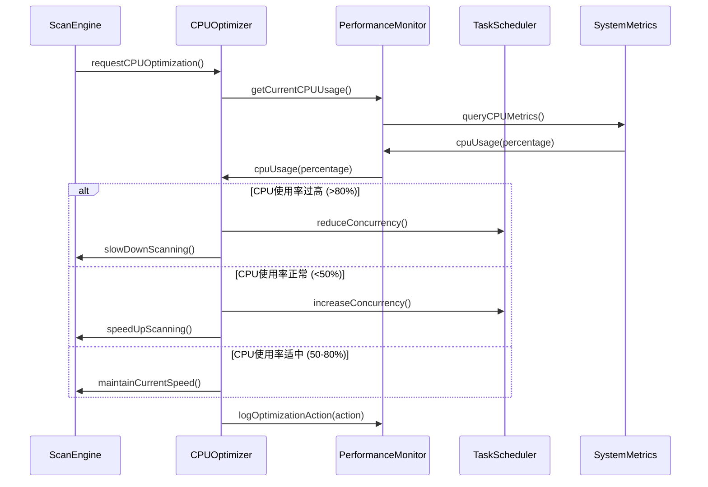
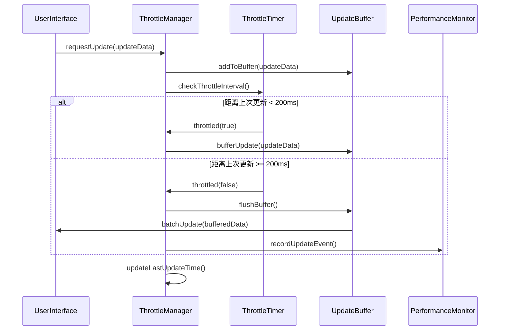
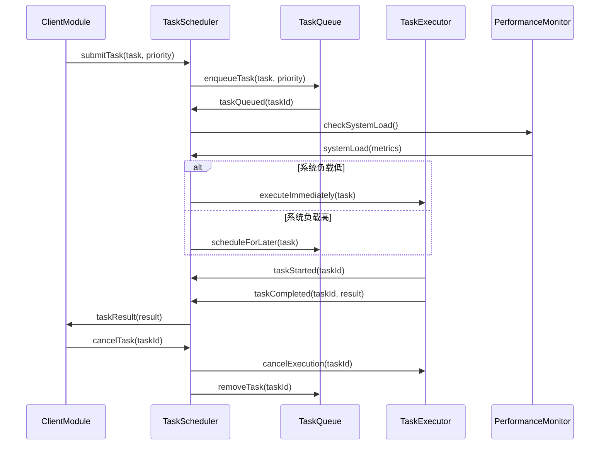
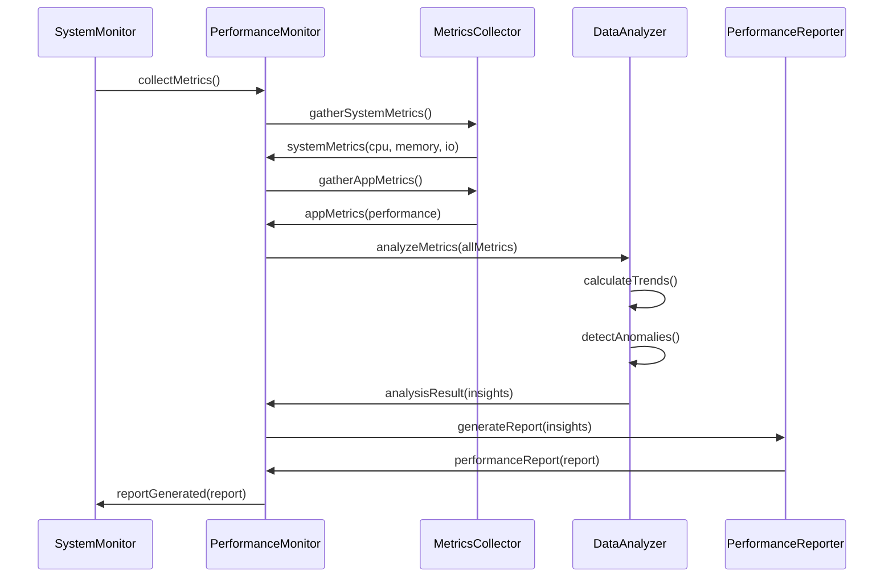
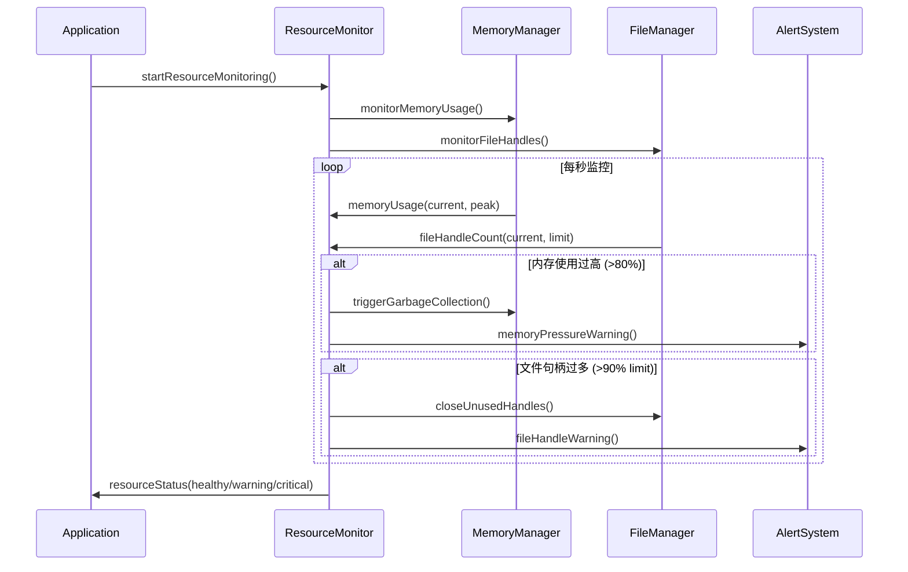

# 模块3：性能优化模块 (PerformanceOptimizer) - 处理流程设计

## 模块概述

**模块名称：** PerformanceOptimizer  
**对应需求特性：** 特性5 - 性能优化和CPU管理  
**核心职责：** 负责系统的性能监控和优化，实现CPU智能管理、节流机制、任务调度等。确保系统高效运行，节省系统资源

## 核心组件

### 1. CPUOptimizer - CPU优化器
**关键逻辑：** 实时监控系统CPU使用率，根据负载动态调整扫描并发度和处理速度。使用自适应算法学习系统性能特征，实现平均80%+的CPU使用节省效果。

**实现步骤：**
- 使用host_processor_info获取系统CPU使用率统计
- 根据CPU使用率动态调整OperationQueue的maxConcurrentOperationCount
- 实现自适应算法，学习系统负载模式并预测最优并发度
- 记录优化前后的CPU使用对比，计算节省百分比

### 2. ThrottleManager - 节流管理器
**关键逻辑：** 实现200ms最小间隔的更新节流机制，缓冲短时间内的多个更新请求并批量处理。使用高精度计时器确保节流精度，支持紧急更新的优先通道。

**实现步骤：**
- 使用DispatchSourceTimer创建高精度200ms定时器
- 维护更新请求缓冲队列，收集短时间内的多个更新
- 定时器触发时批量处理缓冲的更新请求
- 实现紧急更新通道，用户交互触发的更新立即执行

### 3. TaskScheduler - 任务调度器
**关键逻辑：** 基于任务优先级和系统负载进行智能调度，支持任务的动态优先级调整。实现任务队列管理和负载均衡，提供任务取消和资源清理机制。

**实现步骤：**
- 使用优先级队列(PriorityQueue)管理不同优先级的任务
- 监控系统负载，高负载时延迟执行低优先级任务
- 实现任务抢占机制，高优先级任务可中断低优先级任务
- 提供任务取消接口，及时清理被取消任务的资源

### 4. PerformanceMonitor - 性能监控器
**关键逻辑：** 收集CPU、内存、I/O等系统指标，分析性能趋势和瓶颈。生成性能报告和优化建议，支持实时性能仪表板和历史数据分析。

**实现步骤：**
- 使用mach_task_basic_info获取应用内存使用统计
- 定期采样系统指标，维护性能数据的时间序列
- 实现性能趋势分析，识别性能退化和瓶颈
- 生成可视化性能报告，提供优化建议和对比数据

## 依赖关系

- **依赖模块**: 无 (基础设施模块)
- **被依赖模块**: ScanEngine, DirectoryTreeView, TreeMapVisualization

## 主要处理流程

### 流程1：CPU使用监控和优化流程



**详细步骤：**
1. **CPU使用率监控**
   - 实时监控系统CPU使用率 - 每秒查询系统CPU统计，计算使用百分比
   - 监控应用程序CPU占用 - 跟踪进程CPU时间，计算应用程序占用比例
   - 检测CPU使用峰值 - 识别CPU使用突增，触发优化策略
   - 记录CPU使用历史数据 - 维护滑动窗口历史，分析使用趋势

2. **动态优化策略**
   - 高CPU使用时降低扫描速度 - 减少并发线程数，增加任务间隔时间
   - 低CPU使用时提高处理效率 - 增加并发度，减少等待时间
   - 根据系统负载调整并发度 - 基于CPU核心数和负载动态调整线程池大小
   - 智能分配CPU资源 - 优先保证UI响应，合理分配后台任务资源

3. **优化效果统计**
   - 记录CPU节省百分比 - 对比优化前后的CPU使用，计算节省效果
   - 统计优化前后对比 - 生成性能对比报告，量化优化收益
   - 计算性能提升指标 - 测量任务完成时间、响应延迟等关键指标
   - 生成优化报告 - 创建可视化报告，展示优化效果和趋势

4. **自适应调整**
   - 根据硬件配置调整策略 - 检测CPU核心数、内存大小，调整优化参数
   - 学习用户使用模式 - 分析用户操作习惯，预测资源需求
   - 优化算法参数调整 - 基于历史数据调整阈值和权重参数
   - 持续改进优化效果 - 使用机器学习算法不断优化策略

### 流程2：节流机制管理流程 (200ms统计更新)



**详细步骤：**
1. **更新请求缓冲**
   - 收集短时间内的多个更新请求
   - 合并相似的更新操作
   - 去除重复的更新数据
   - 优化更新数据结构

2. **时间间隔控制**
   - 维护200ms的最小更新间隔
   - 使用高精度计时器
   - 处理时间漂移问题
   - 确保更新频率稳定

3. **批量更新处理**
   - 将缓冲的更新合并处理
   - 减少UI重绘次数
   - 优化数据传输效率
   - 保持界面响应性

4. **节流效果监控**
   - 统计节流前后更新频率
   - 计算CPU使用节省量
   - 监控用户体验影响
   - 调整节流参数

### 流程3：任务调度和优先级管理流程



**详细步骤：**
1. **任务优先级分类**
   - 用户交互任务 (最高优先级)
   - 界面更新任务 (高优先级)
   - 数据处理任务 (中优先级)
   - 后台维护任务 (低优先级)

2. **智能调度策略**
   - 根据系统负载调整执行策略
   - 优先处理用户可见的任务
   - 延迟执行非关键任务
   - 避免任务饥饿问题

3. **任务取消机制**
   - 支持任务执行前取消
   - 支持任务执行中中断
   - 清理任务相关资源
   - 通知任务状态变化

4. **负载均衡**
   - 监控各个执行器负载
   - 动态分配任务到空闲执行器
   - 避免单点过载
   - 优化整体执行效率

### 流程4：性能指标监控和统计流程



**详细步骤：**
1. **系统指标收集**
   - CPU使用率和负载
   - 内存使用量和压力
   - 磁盘I/O速率
   - 网络使用情况

2. **应用指标收集**
   - 扫描处理速度
   - 界面响应时间
   - 内存分配情况
   - 任务执行统计

3. **性能趋势分析**
   - 识别性能瓶颈
   - 预测资源需求
   - 检测性能退化
   - 优化建议生成

4. **性能报告生成**
   - 实时性能仪表板
   - 历史性能趋势图
   - 优化效果对比
   - 性能改进建议

### 流程5：资源使用监控和管理流程



**详细步骤：**
1. **内存使用监控**
   - 跟踪应用内存分配
   - 监控内存泄漏
   - 检测内存压力
   - 触发垃圾回收

2. **文件句柄管理**
   - 监控打开的文件数量
   - 及时关闭不使用的文件
   - 避免文件句柄泄漏
   - 优化文件访问模式

3. **资源预警机制**
   - 设置资源使用阈值
   - 提前预警资源不足
   - 自动释放不必要资源
   - 防止系统资源耗尽

4. **资源优化策略**
   - 延迟加载非关键资源
   - 使用对象池减少分配
   - 缓存频繁使用的数据
   - 定期清理临时资源

## 性能优化策略

### 1. CPU优化策略
- 智能调整扫描并发度
- 根据系统负载动态调节
- 避免CPU密集型操作阻塞
- 使用高效的算法和数据结构

### 2. 内存优化策略
- 及时释放不使用的对象
- 使用弱引用避免循环引用
- 实现内存池管理
- 监控和防止内存泄漏

### 3. I/O优化策略
- 使用异步I/O操作
- 批量处理文件操作
- 缓存频繁访问的数据
- 优化文件读写模式

### 4. 界面优化策略
- 减少不必要的界面更新
- 使用虚拟化技术处理大数据
- 优化绘制和布局计算
- 实现平滑的动画效果

## 接口定义

```swift
protocol PerformanceOptimizerProtocol {
    // CPU优化
    func optimizeCPUUsage() async
    func getCurrentCPUUsage() -> Double
    func setCPUUsageLimit(_ limit: Double)
    
    // 节流管理
    func shouldThrottleUpdate() -> Bool
    func recordUpdateEvent()
    func getUpdateFrequency() -> Double
    
    // 任务调度
    func scheduleTask(_ task: PerformanceTask, priority: TaskPriority) -> UUID
    func cancelTask(_ taskId: UUID)
    func getTaskStatus(_ taskId: UUID) -> TaskStatus
    
    // 性能监控
    func startPerformanceMonitoring()
    func stopPerformanceMonitoring()
    func getPerformanceMetrics() -> PerformanceMetrics
    func generatePerformanceReport() -> PerformanceReport
    
    // 资源管理
    func getResourceUsage() -> ResourceUsage
    func optimizeResourceUsage()
    var resourceStatus: Published<ResourceStatus> { get }
}

struct PerformanceMetrics {
    let cpuUsage: Double
    let memoryUsage: Int64
    let diskIORate: Double
    let taskExecutionTime: TimeInterval
    let updateFrequency: Double
    let optimizationSavings: Double
}

struct ResourceUsage {
    let memoryUsed: Int64
    let memoryAvailable: Int64
    let fileHandlesUsed: Int
    let fileHandlesLimit: Int
    let diskSpaceUsed: Int64
    let diskSpaceAvailable: Int64
}

enum TaskPriority {
    case critical
    case high
    case normal
    case low
    case background
}

enum ResourceStatus {
    case healthy
    case warning
    case critical
}
```

## 测试策略

### 1. 性能测试
- CPU使用率优化效果测试
- 内存使用效率测试
- 任务调度性能测试
- 节流机制效果测试

### 2. 压力测试
- 高负载下的性能表现
- 资源耗尽情况处理
- 长时间运行稳定性
- 并发任务处理能力

### 3. 优化效果测试
- 优化前后性能对比
- 不同硬件配置适应性
- 用户体验影响评估
- 电池使用优化效果

### 4. 监控准确性测试
- 性能指标收集准确性
- 资源使用监控精度
- 预警机制及时性
- 报告数据完整性

## 监控指标

### 1. 性能指标
- CPU使用率和优化效果
- 内存使用量和泄漏检测
- 任务执行时间和吞吐量
- 界面响应时间

### 2. 优化效果指标
- CPU节省百分比
- 内存使用优化程度
- 任务调度效率
- 用户体验改善度

### 3. 系统稳定性指标
- 资源使用稳定性
- 性能退化检测
- 异常处理覆盖率
- 长期运行可靠性