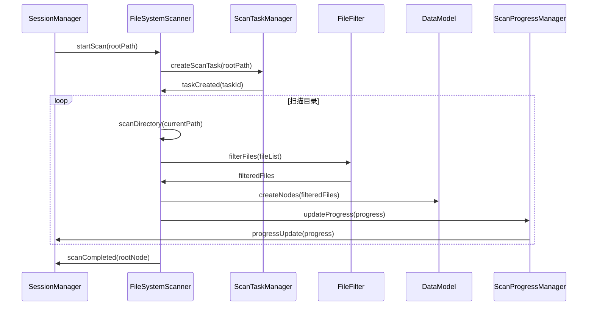
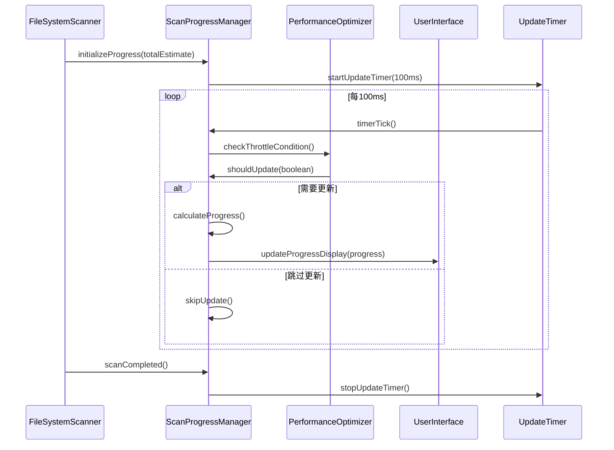
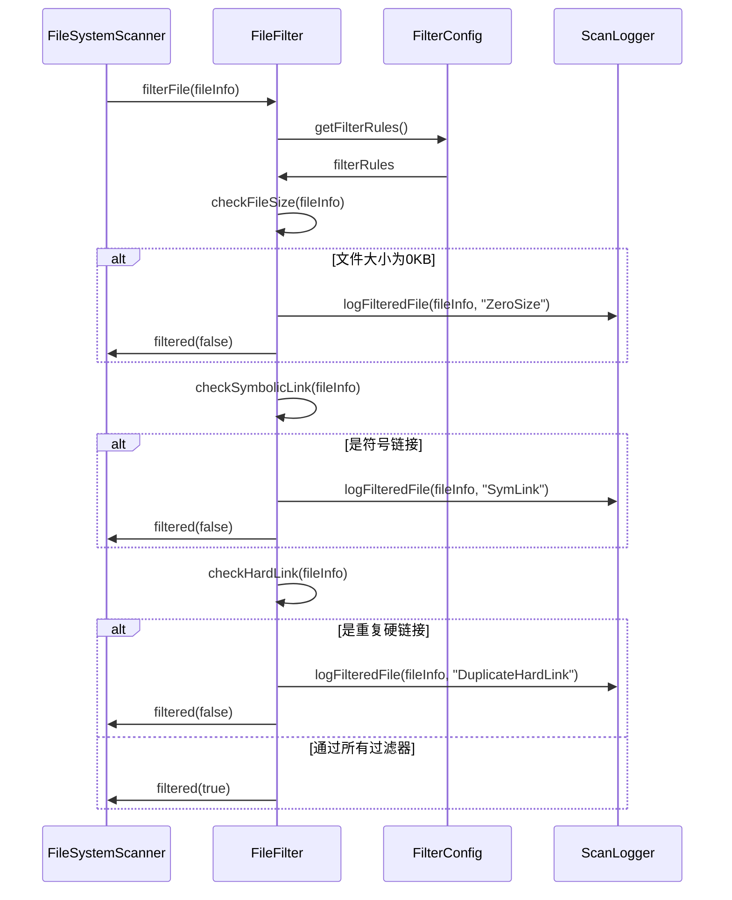
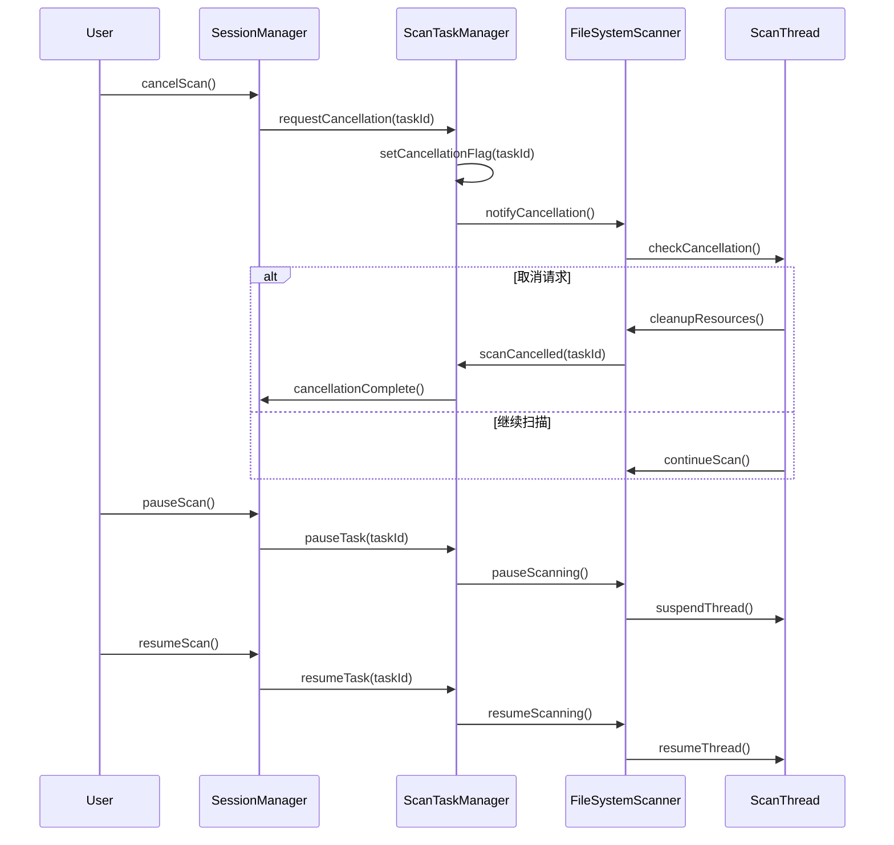
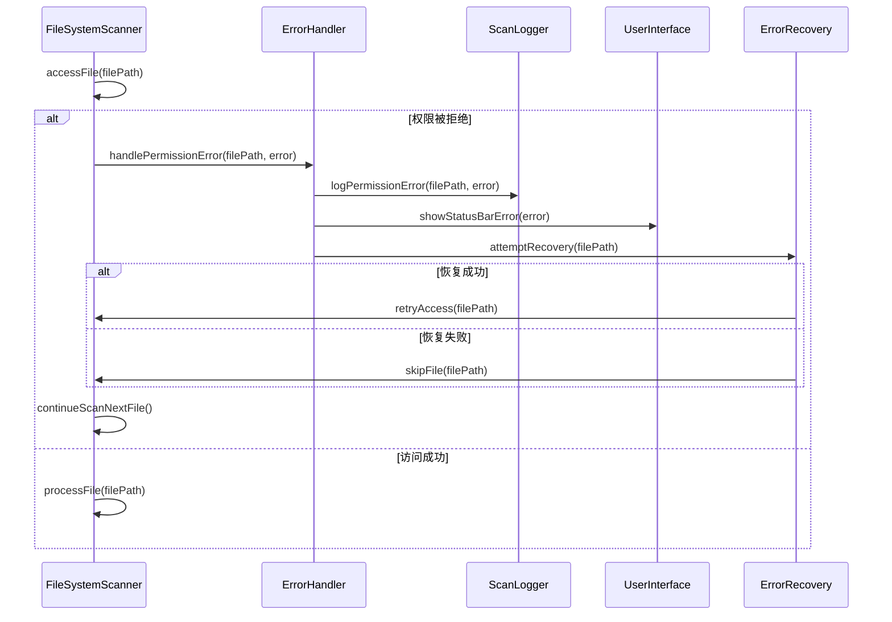

# 模块2：扫描引擎模块 (ScanEngine) - 处理流程设计

## 模块概述

**模块名称：** ScanEngine  
**对应需求特性：** 特性1 - 磁盘扫描和数据采集  
**核心职责：** 负责文件系统的高性能扫描，包括异步扫描、进度跟踪、文件过滤和数据采集。实现100ms高频更新机制，支持扫描控制和异步任务管理

## 核心组件

### 1. FileSystemScanner - 核心扫描引擎
**关键逻辑：** 使用深度优先遍历算法扫描文件系统，采用异步I/O操作提高性能。处理符号链接和挂载点的特殊情况，支持权限错误的优雅处理和跳过机制。

**实现步骤：**
- 使用FileManager.enumerator递归遍历目录结构
- 异步处理每个文件，使用DispatchQueue.concurrentPerform并发处理
- 检测符号链接通过FileAttributeKey.type判断文件类型
- 权限错误时捕获异常，记录错误信息后继续扫描其他文件

### 2. ScanProgressManager - 进度管理器
**关键逻辑：** 实现100ms固定频率的进度更新机制，使用节流技术避免过度更新。计算扫描百分比和预估剩余时间，支持进度数据的批量处理和异步通知。

**实现步骤：**
- 使用Timer.scheduledTimer每100ms触发一次更新检查
- 维护已处理文件数和总预估文件数计算百分比
- 基于处理速度和剩余文件数计算预估时间
- 批量收集进度事件，在定时器触发时统一发送更新

### 3. FileFilter - 文件过滤器
**关键逻辑：** 实现0KB文件、符号链接和重复硬链接的智能过滤。维护inode索引表进行硬链接去重，支持可配置的过滤规则和实时过滤统计。

**实现步骤：**
- 检查文件大小为0时直接过滤，记录过滤统计
- 使用Set<UInt64>存储已处理的inode号码进行硬链接去重
- 通过FileAttributeKey.systemFileNumber获取inode信息
- 维护过滤规则数组，依次应用每个规则进行文件筛选

### 4. ScanTaskManager - 异步任务管理器
**关键逻辑：** 管理扫描任务的生命周期，支持任务的创建、暂停、恢复和取消。实现任务状态的线程安全管理，提供任务优先级调度和资源控制机制。

**实现步骤：**
- 使用OperationQueue管理扫描任务，支持任务取消和暂停
- 通过AtomicBool维护任务状态，确保线程安全的状态检查
- 实现任务优先级队列，高优先级任务优先执行
- 监控系统资源使用，动态调整并发任务数量

## 依赖关系

- **依赖模块**: DataModel, PerformanceOptimizer
- **被依赖模块**: SessionManager

## 主要处理流程

### 流程1：异步文件系统扫描流程



**详细步骤：**
1. **扫描初始化**
   - 验证扫描路径有效性 - 检查路径格式和存在性，处理相对路径转换
   - 检查文件系统访问权限 - 预检查读取权限，识别受保护目录
   - 创建异步扫描任务 - 在后台线程池中创建任务，设置任务优先级
   - 初始化进度跟踪器 - 创建进度对象，设置更新回调和统计计数器

2. **目录遍历**
   - 使用深度优先遍历算法 - 递归遍历目录树，优先处理子目录
   - 异步处理子目录 - 使用并发队列处理多个子目录，控制并发数量
   - 处理符号链接和挂载点 - 检测链接类型，避免循环引用和重复计算
   - 跳过系统保护目录 - 识别系统目录模式，跳过无权限访问的路径

3. **文件信息收集**
   - 获取文件基本属性 - 调用stat系统调用获取文件元数据
   - 计算文件实际大小 - 区分逻辑大小和物理占用，处理稀疏文件
   - 读取文件元数据 - 获取创建时间、修改时间和权限信息
   - 处理特殊文件类型 - 识别设备文件、管道文件等特殊类型

4. **数据节点创建**
   - 创建FileNode对象 - 实例化节点对象，设置基本属性和唯一ID
   - 建立父子关系 - 设置父节点引用，将节点添加到父节点的子列表
   - 更新目录树结构 - 维护树的完整性，更新路径索引映射
   - 触发界面更新 - 发送数据更新通知，触发UI组件的增量刷新

### 流程2：实时进度更新流程 (100ms频率)



**详细步骤：**
1. **进度计算**
   - 已扫描文件数量统计
   - 已处理字节数统计
   - 当前扫描路径记录
   - 预估剩余时间计算

2. **更新频率控制**
   - 100ms固定更新间隔
   - CPU使用率监控
   - 智能节流机制
   - 性能优化调整

3. **进度数据结构**
   - 扫描百分比
   - 文件处理速度
   - 错误统计信息
   - 性能指标数据

4. **界面更新触发**
   - 异步UI更新调用
   - 进度条数值更新
   - 状态文本更新
   - 统计信息刷新

### 流程3：文件过滤处理流程



**详细步骤：**
1. **0KB文件过滤**
   - 检查文件实际大小
   - 区分空文件和稀疏文件
   - 记录过滤统计信息
   - 保持扫描性能

2. **符号链接处理**
   - 识别符号链接类型
   - 避免循环引用
   - 记录链接目标信息
   - 防止重复计算

3. **硬链接去重**
   - 维护inode索引表
   - 检测重复硬链接
   - 只计算一次文件大小
   - 更新引用计数

4. **过滤规则配置**
   - 可配置过滤规则
   - 文件类型过滤
   - 路径模式匹配
   - 自定义过滤逻辑

### 流程4：扫描控制和任务管理流程



**详细步骤：**
1. **扫描启动控制**
   - 验证扫描参数
   - 创建后台扫描线程
   - 初始化扫描状态
   - 开始异步扫描

2. **扫描暂停/恢复**
   - 保存当前扫描状态
   - 暂停扫描线程执行
   - 保持已扫描数据
   - 支持从断点恢复

3. **扫描取消处理**
   - 设置取消标志位
   - 清理扫描资源
   - 保存部分扫描结果
   - 通知界面更新

4. **任务状态管理**
   - 跟踪任务执行状态
   - 管理多个并发任务
   - 处理任务优先级
   - 资源使用监控

### 流程5：权限错误处理流程



**详细步骤：**
1. **权限检查**
   - 预检查目录访问权限
   - 处理受保护的系统目录
   - 识别权限不足的文件
   - 记录权限错误信息

2. **错误分类处理**
   - 区分临时和永久错误
   - 权限不足错误处理
   - 文件被占用错误处理
   - 网络路径访问错误

3. **非干扰性错误提示**
   - 在状态栏显示错误信息
   - 避免弹出阻塞对话框
   - 累积错误统计信息
   - 提供错误详情查看

4. **扫描继续策略**
   - 跳过无权限文件
   - 继续扫描其他区域
   - 保持扫描进度
   - 确保数据完整性

## 性能优化策略

### 1. 扫描性能优化
- 使用异步I/O操作
- 实现并发目录扫描
- 优化文件系统调用
- 缓存频繁访问的数据

### 2. 内存使用优化
- 流式处理大目录
- 及时释放不需要的数据
- 使用内存池管理对象
- 控制内存使用峰值

### 3. CPU使用优化
- 智能节流机制
- 避免不必要的计算
- 优化算法复杂度
- 平衡CPU和I/O使用

### 4. 进度更新优化
- 100ms固定更新频率
- 批量处理进度事件
- 减少UI更新开销
- 智能跳过无变化更新

## 接口定义

```swift
protocol ScanEngineProtocol {
    // 扫描控制
    func startScan(path: String) async throws
    func pauseScan() async
    func resumeScan() async
    func cancelScan() async
    
    // 进度监控
    var scanProgress: Published<ScanProgress> { get }
    var currentPath: Published<String> { get }
    var isScanning: Published<Bool> { get }
    
    // 数据输出
    var discoveredNodes: Published<[FileNode]> { get }
    var rootNode: Published<FileNode?> { get }
    
    // 配置管理
    func setFilterRules(_ rules: [FilterRule])
    func setScanOptions(_ options: ScanOptions)
    
    // 错误处理
    var scanErrors: Published<[ScanError]> { get }
    func clearErrors()
}

protocol FileFilterProtocol {
    func shouldIncludeFile(_ fileInfo: FileInfo) -> Bool
    func shouldIncludeDirectory(_ dirInfo: DirectoryInfo) -> Bool
    func addFilterRule(_ rule: FilterRule)
    func removeFilterRule(_ ruleId: UUID)
}

struct ScanOptions {
    var followSymlinks: Bool = false
    var includeHiddenFiles: Bool = false
    var maxDepth: Int? = nil
    var excludePatterns: [String] = []
    var includePatterns: [String] = []
}

struct FilterRule {
    let id: UUID
    let type: FilterType
    let pattern: String
    let isEnabled: Bool
    
    enum FilterType {
        case fileSize
        case fileName
        case filePath
        case fileType
        case custom((FileInfo) -> Bool)
    }
}
```

## 测试策略

### 1. 功能测试
- 基本扫描功能测试
- 文件过滤准确性测试
- 进度更新正确性测试
- 扫描控制功能测试

### 2. 性能测试
- 大目录扫描性能测试
- 内存使用效率测试
- CPU使用率测试
- 并发扫描性能测试

### 3. 错误处理测试
- 权限错误处理测试
- 网络中断恢复测试
- 文件系统错误测试
- 资源不足处理测试

### 4. 边界条件测试
- 空目录扫描测试
- 超深目录层级测试
- 超大文件处理测试
- 特殊字符文件名测试

## 监控指标

### 1. 性能指标
- 扫描速度 (文件/秒)
- 内存使用量
- CPU使用率
- I/O操作频率

### 2. 质量指标
- 扫描准确性
- 过滤规则正确性
- 进度更新精度
- 错误处理完整性

### 3. 用户体验指标
- 扫描响应时间
- 进度更新流畅度
- 错误提示及时性
- 扫描控制响应性