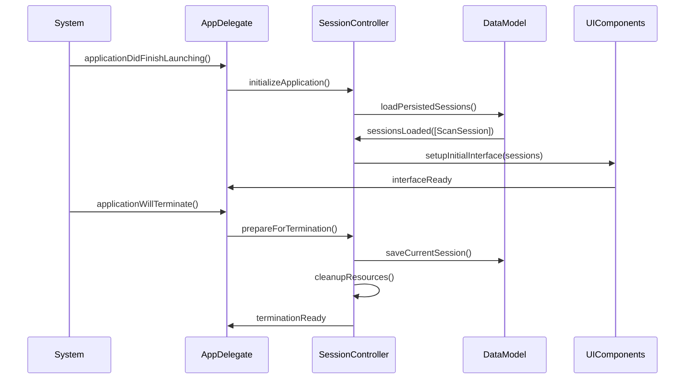
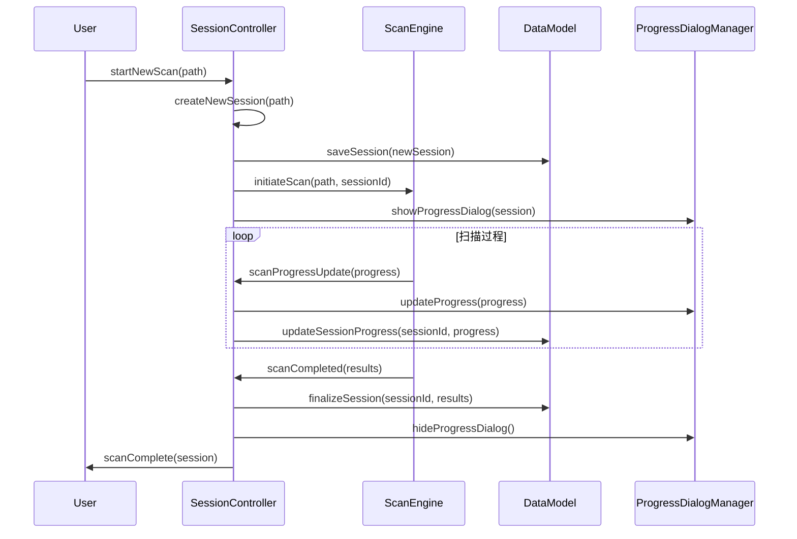
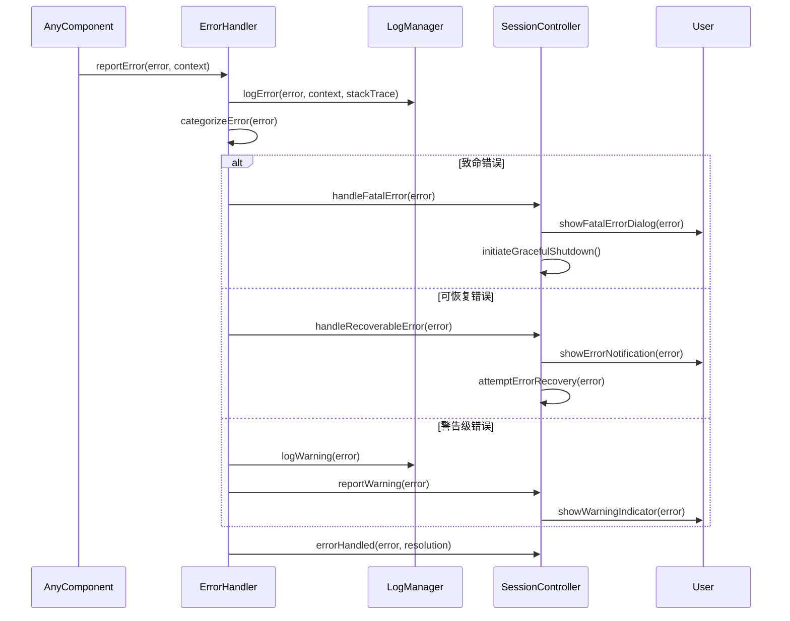
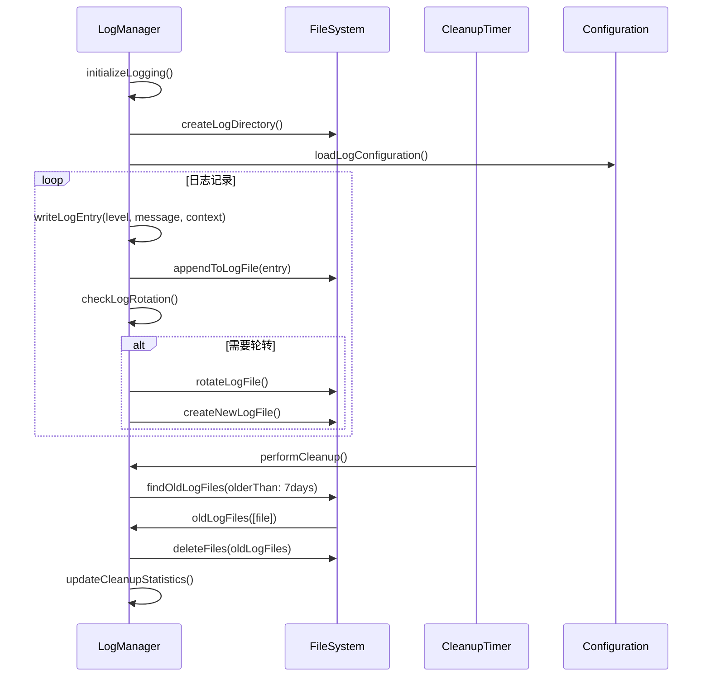
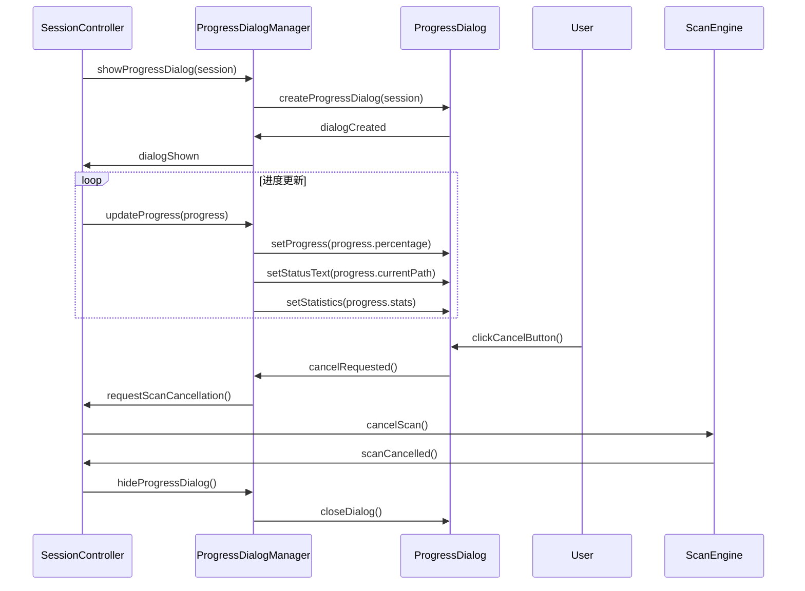

# 模块8：会话管理模块 (SessionManager) - 处理流程设计

## 模块概述

**模块名称：** SessionManager  
**对应需求特性：** 特性8 - 会话管理和错误处理  
**核心职责：** 管理扫描会话的生命周期，提供错误处理、日志记录、会话持久化等运行时管理功能，确保用户数据安全和系统稳定性

## 核心组件

### 1. SessionController - 会话控制器
**关键逻辑：** 管理扫描会话的完整生命周期，协调各模块间的数据流和状态同步。实现会话的创建、更新、保存和恢复，支持多会话的并发管理和优先级调度。

**实现步骤：**
- 使用UUID生成唯一会话标识符，维护会话状态字典
- 协调ScanEngine、DataModel、UI等模块的数据流
- 实现会话状态机，管理创建→进行中→完成→保存的状态转换
- 支持多会话并发，使用优先级队列管理会话执行顺序

### 2. ErrorHandler - 错误处理器
**关键逻辑：** 统一处理系统中的各种错误和异常，根据错误类型和严重程度进行分类处理。实现非干扰性的错误提示机制，支持错误恢复和用户友好的错误信息展示。

**实现步骤：**
- 定义错误分类：致命错误、可恢复错误、警告级错误
- 实现错误恢复策略，自动重试机制和用户手动恢复选项
- 在状态栏显示非阻塞的错误提示，避免弹窗干扰用户
- 记录错误上下文和堆栈信息，便于问题诊断和修复

### 3. LogManager - 日志管理器
**关键逻辑：** 实现多级别的日志记录系统，支持异步写入和日志轮转。自动管理日志文件的大小和数量，提供7天自动清理机制，确保日志系统的高性能和存储效率。

**实现步骤：**
- 使用DispatchQueue创建专用日志队列，异步写入避免阻塞主线程
- 实现日志级别过滤：DEBUG、INFO、WARNING、ERROR、FATAL
- 按日期和大小轮转日志文件，单文件最大10MB
- 定时清理7天前的日志文件，使用FileManager.removeItem删除

### 4. ProgressDialogManager - 进度对话框管理器
**关键逻辑：** 管理扫描进度对话框的显示和更新，提供实时的进度信息和取消功能。处理对话框的模态状态和用户交互，确保进度显示的准确性和响应性。

**实现步骤：**
- 创建NSWindow作为进度对话框，包含NSProgressIndicator和取消按钮
- 实现进度更新的节流机制，避免过度频繁的UI更新
- 处理用户取消操作，通过回调通知SessionController停止扫描
- 管理对话框的模态状态，确保用户可以取消但不能进行其他操作

### 5. AppDelegate - 应用程序委托
**关键逻辑：** 处理应用程序的启动、终止和系统事件，管理应用程序的全局状态和配置。协调应用程序生命周期中的资源初始化和清理，确保应用程序的稳定运行。

**实现步骤：**
- 在applicationDidFinishLaunching中初始化核心组件和服务
- 实现applicationWillTerminate，保存用户数据和清理资源
- 处理applicationDidBecomeActive和applicationWillResignActive，管理应用状态
- 监听系统事件如内存警告，触发相应的资源清理机制

## 主要处理流程

### 流程1：应用程序生命周期管理流程



**详细步骤：**
1. **应用启动初始化**
   - 初始化核心组件和服务
   - 加载用户配置和偏好设置
   - 恢复上次的会话状态
   - 设置错误处理和日志系统

2. **会话恢复**
   - 从持久化存储加载历史会话 - 读取会话文件，反序列化会话数据
   - 验证会话数据的完整性 - 检查数据格式和版本兼容性
   - 恢复最后一次的扫描状态 - 重建扫描进度和结果数据
   - 重建UI界面状态 - 恢复窗口位置、展开状态等界面设置

3. **界面初始化**
   - 根据会话数据设置初始界面 - 配置目录树和TreeMap的初始显示
   - 显示历史扫描结果 - 加载并显示上次扫描的结果数据
   - 配置用户界面组件 - 设置各组件的初始状态和属性
   - 建立组件间的数据绑定 - 连接数据模型与UI组件的响应关系

4. **应用终止处理**
   - 保存当前会话状态 - 序列化当前会话数据到持久化存储
   - 清理临时文件和资源 - 删除临时文件，释放系统资源
   - 关闭日志文件 - 刷新日志缓冲区，安全关闭日志文件
   - 确保数据完整性 - 验证保存的数据完整性，处理保存失败情况

### 流程2：扫描会话管理流程



**详细步骤：**
1. **新会话创建**
   - 生成唯一的会话标识符
   - 记录扫描开始时间和路径
   - 初始化会话统计数据
   - 设置会话状态为"进行中"

2. **扫描进度管理**
   - 实时更新扫描进度信息
   - 显示进度对话框和状态
   - 处理用户的取消请求
   - 记录扫描性能指标

3. **会话数据更新**
   - 增量更新会话统计信息
   - 保存扫描中间结果
   - 维护会话状态一致性
   - 处理异常中断情况

4. **会话完成处理**
   - 标记会话为已完成状态
   - 计算最终统计数据
   - 保存完整的扫描结果
   - 更新会话历史记录

### 流程3：错误处理和恢复流程



**详细步骤：**
1. **错误分类和评估**
   - 根据错误类型和严重程度分类
   - 评估错误对系统稳定性的影响
   - 确定错误处理策略
   - 记录错误上下文信息

2. **致命错误处理**
   - 立即停止所有正在进行的操作
   - 保存当前状态和用户数据
   - 显示详细的错误信息对话框
   - 提供错误报告和恢复选项

3. **可恢复错误处理**
   - 尝试自动恢复机制
   - 提供用户手动恢复选项
   - 显示非阻塞的错误通知
   - 记录恢复过程和结果

4. **警告处理**
   - 在状态栏显示警告指示器
   - 记录警告信息到日志
   - 不中断用户当前操作
   - 提供查看详细信息的入口

### 流程4：日志管理和清理流程



**详细步骤：**
1. **日志系统初始化**
   - 创建日志目录结构
   - 配置日志级别和格式
   - 设置日志文件轮转策略
   - 初始化日志写入器

2. **日志记录**
   - 格式化日志条目
   - 异步写入日志文件
   - 处理日志写入错误
   - 实现日志缓冲和刷新

3. **日志轮转**
   - 监控日志文件大小
   - 按时间或大小轮转日志
   - 压缩旧日志文件
   - 维护日志文件索引

4. **自动清理**
   - 定期清理过期日志文件
   - 保留最近7天的日志
   - 清理临时和缓存文件
   - 统计清理效果

### 流程5：进度对话框管理流程



**详细步骤：**
1. **进度对话框创建**
   - 创建模态或非模态进度对话框
   - 设置对话框的初始状态
   - 配置进度条和状态显示
   - 添加取消按钮和快捷键

2. **进度信息更新**
   - 更新进度百分比显示
   - 显示当前扫描路径
   - 更新统计信息 (文件数、大小等)
   - 显示预估剩余时间

3. **用户交互处理**
   - 处理取消按钮点击
   - 响应键盘快捷键
   - 处理对话框关闭事件
   - 维护对话框的响应性

4. **对话框生命周期**
   - 在适当时机显示对话框
   - 及时更新对话框内容
   - 在操作完成时隐藏对话框
   - 清理对话框资源

## 会话数据结构设计


## 性能优化策略

### 1. 会话管理优化
- 使用增量保存减少I/O开销
- 实现会话数据的压缩存储
- 优化会话查询和索引
- 缓存频繁访问的会话数据

### 2. 错误处理优化
- 使用异步错误处理避免阻塞
- 实现错误去重减少重复处理
- 优化错误日志的写入性能
- 缓存错误处理策略

### 3. 日志系统优化
- 使用缓冲写入提高性能
- 实现日志压缩节省空间
- 异步日志写入避免阻塞
- 智能日志轮转策略

### 4. 内存管理优化
- 及时释放不使用的会话数据
- 使用弱引用避免循环引用
- 实现会话数据的延迟加载
- 优化大对象的内存占用

## 接口定义

```swift
protocol SessionManagerProtocol {
    // 会话管理
    func createSession(scanPath: String) -> ScanSession
    func saveSession(_ session: ScanSession)
    func loadSession(_ sessionId: UUID) -> ScanSession?
    func deleteSession(_ sessionId: UUID)
    func getAllSessions() -> [ScanSession]
    
    // 应用生命周期
    func initializeApplication()
    func prepareForTermination()
    func handleApplicationDidBecomeActive()
    func handleApplicationWillResignActive()
    
    // 错误处理
    func reportError(_ error: Error, context: ErrorContext)
    func getRecentErrors() -> [AppError]
    func clearErrorHistory()
    
    // 进度管理
    func showProgressDialog(for session: ScanSession)
    func updateProgress(_ progress: ScanProgress)
    func hideProgressDialog()
    
    // 事件发布
    var currentSession: Published<ScanSession?> { get }
    var sessionList: Published<[ScanSession]> { get }
    var errorCount: Published<Int> { get }
}

protocol ErrorHandlerProtocol {
    func handleError(_ error: Error, context: ErrorContext)
    func handleFatalError(_ error: AppError)
    func handleRecoverableError(_ error: AppError)
    func attemptErrorRecovery(_ error: AppError) -> Bool
    
    var currentErrors: Published<[AppError]> { get }
    var errorCount: Published<Int> { get }
}
```

## 测试策略

### 1. 会话管理测试
- 会话创建和保存测试
- 会话恢复和完整性测试
- 并发会话处理测试
- 会话数据迁移测试

### 2. 错误处理测试
- 各种错误类型处理测试
- 错误恢复机制测试
- 错误日志记录测试
- 致命错误处理测试

### 3. 日志系统测试
- 日志写入性能测试
- 日志轮转功能测试
- 日志清理机制测试
- 并发日志写入测试

### 4. 集成测试
- 应用生命周期测试
- 组件间协作测试
- 异常情况处理测试
- 用户体验测试

## 监控指标

### 1. 会话管理指标
- 会话创建和保存时间
- 会话数据大小和增长
- 会话恢复成功率
- 会话查询性能

### 2. 错误处理指标
- 错误发生频率和类型
- 错误恢复成功率
- 错误处理响应时间
- 用户错误反馈满意度

### 3. 日志系统指标
- 日志写入性能
- 日志文件大小和数量
- 日志清理效果
- 日志查询效率

### 4. 系统稳定性指标
- 应用崩溃率
- 内存泄漏检测
- 资源使用效率
- 用户会话持续时间