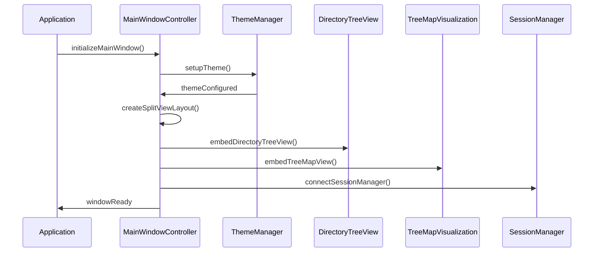
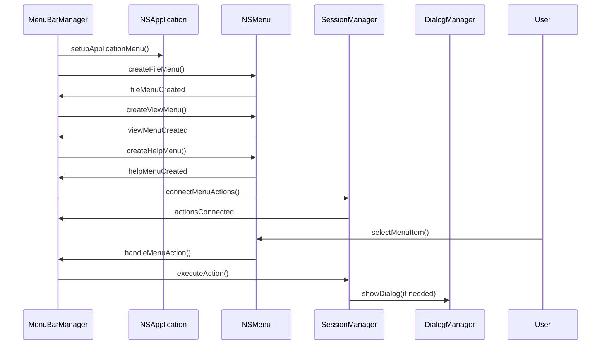
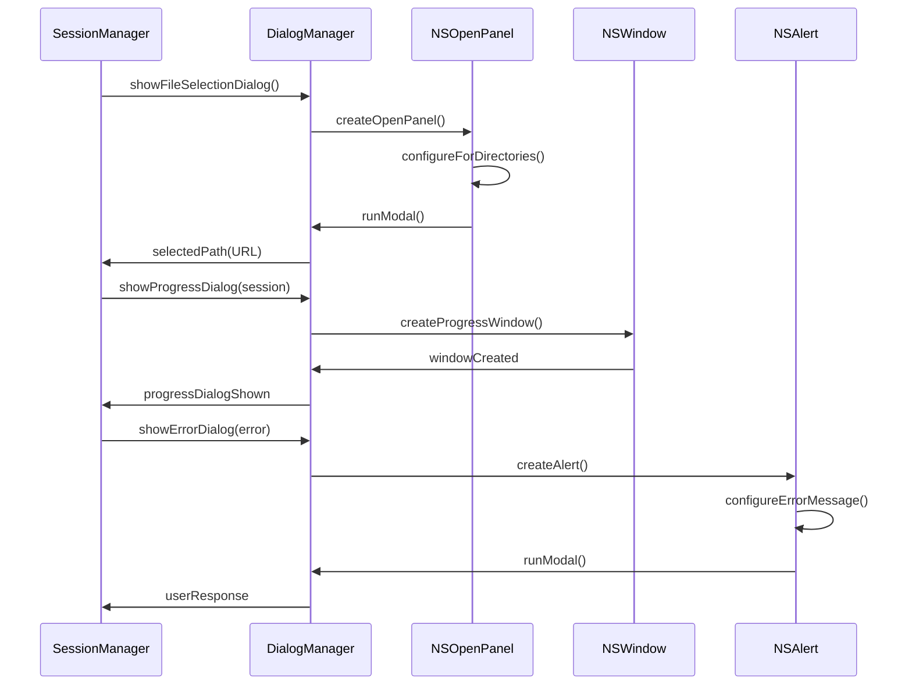
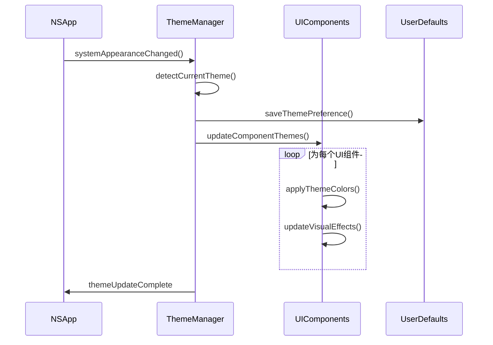
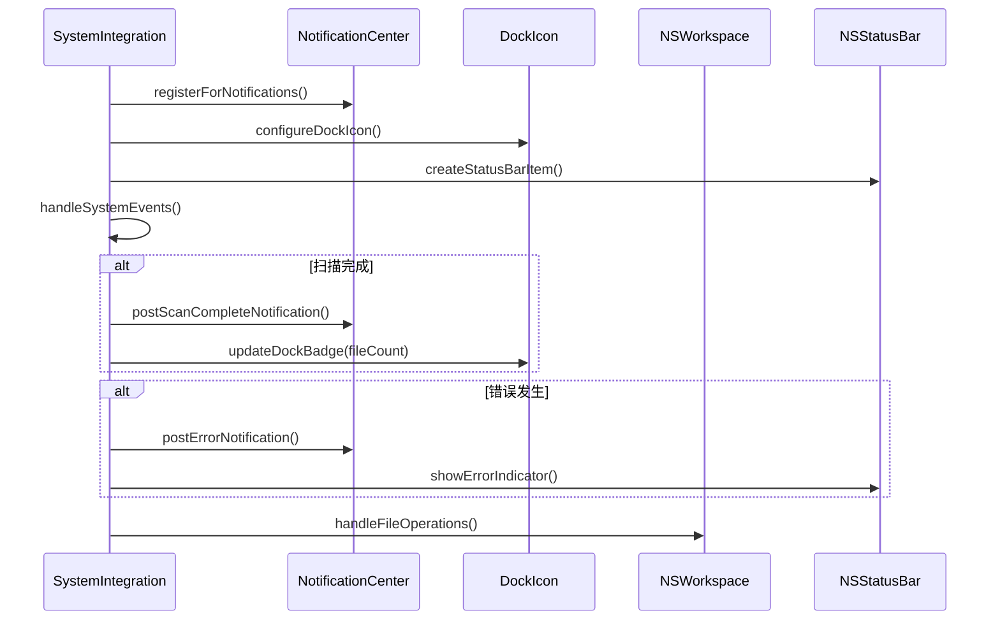

# 模块8：用户界面模块 (UserInterface) - 处理流程设计

## 模块概述

**模块名称：** UserInterface  
**对应需求特性：** 特性7 - 原生macOS用户界面  
**核心职责：** 实现符合macOS设计规范的原生图形用户界面，包括完整的主窗口布局、扫描进度反馈、文件统计显示等，提供一致的用户体验和系统集成功能

## 界面架构设计

### 主窗口布局 (1200x800像素) - 增强版

```
┌─────────────────────────────────────────────────────────────────────────────────┐
│ 📁 选择文件夹 | ▶️ 开始扫描 | ⏸️ 暂停 | ⏹️ 停止 | 🔄 刷新 | ⚙️ 设置 | 📊 统计 │ <- 工具栏 (44px)
├─────────────────────────────────────────────────────────────────────────────────┤
│ 📂 /Users/username/Documents                    ⚡ ████████░░ 80% | ⏱️ 00:02:15 │ <- 进度栏 (32px)
├─────────────────────────────────────────────────────────────────────────────────┤
│                        │                                                        │
│   📁 目录树视图          │              🎨 TreeMap 可视化区域                      │
│   ┌─ 📁 Documents       │    ┌─────────┐ ┌─────┐ ┌───────────────┐              │
│   │  ├─ 📁 Projects     │    │         │ │     │ │               │              │
│   │  │  ├─ 📄 file1.txt │    │   大    │ │ 中  │ │      大       │              │
│   │  │  └─ 📄 file2.pdf │    │  文件   │ │文件 │ │     文件      │              │ <- 主内容区域
│   │  ├─ 📁 Images       │    │         │ │     │ │               │              │
│   │  └─ 📁 Videos       │    └─────────┘ └─────┘ └───────────────┘              │
│   ├─ 📁 Downloads       │    ┌───┐ ┌─────┐ ┌──┐ ┌─────────────────┐            │
│   └─ 📁 Pictures        │    │小 │ │ 中等│ │小│ │      超大       │            │
│                        │    │文│ │文件 │ │文│ │     文件        │            │
│                        │    └───┘ └─────┘ └──┘ └─────────────────┘            │
├─────────────────────────────────────────────────────────────────────────────────┤
│ 📊 扫描中: /Users/username/Documents/Projects | 📁 12,345 文件 | 📂 1,234 文件夹 │ <- 状态栏 (28px)
│ 💾 总大小: 15.6 GB | 🚀 速度: 2,500 文件/秒 | ⚠️ 3 个错误 | 🕒 剩余: ~00:01:30  │
└─────────────────────────────────────────────────────────────────────────────────┘
```

### 扫描状态界面设计

#### 1. 扫描前状态 (就绪状态)
```
工具栏: [📁 选择文件夹] [▶️ 开始扫描(禁用)] [设置] [统计]
进度栏: 隐藏
状态栏: "📊 就绪 - 请选择要扫描的文件夹"
```

#### 2. 扫描进行中状态
```
工具栏: [📁 选择文件夹(禁用)] [⏸️ 暂停] [⏹️ 停止] [设置(禁用)]
进度栏: 显示 - "📂 /path/to/current/folder    ⚡ ████████░░ 80% | ⏱️ 00:02:15"
状态栏: "📊 扫描中: /current/path | 📁 12,345 文件 | 💾 15.6 GB | 🚀 2,500 文件/秒"
```

#### 3. 扫描暂停状态
```
工具栏: [📁 选择文件夹(禁用)] [▶️ 继续] [⏹️ 停止] [设置(禁用)]
进度栏: 显示 - "⏸️ 已暂停    ⚡ ████████░░ 80% | ⏱️ 00:02:15"
状态栏: "⏸️ 已暂停 | 📁 12,345 文件 | 💾 15.6 GB | 最后扫描: /last/path"
```

#### 4. 扫描完成状态
```
工具栏: [📁 选择文件夹] [🔄 重新扫描] [📊 统计] [💾 导出]
进度栏: 显示 - "✅ 扫描完成    ⚡ ██████████ 100% | ⏱️ 00:03:45"
状态栏: "✅ 扫描完成 | 📁 25,678 文件 | 📂 2,456 文件夹 | 💾 28.9 GB"
```

## 核心组件设计

### 1. ToolbarManager - 增强工具栏管理器
**关键逻辑：** 管理工具栏的创建和状态更新，根据扫描状态动态调整按钮可用性和显示内容。

**按钮设计：**
- **📁 选择文件夹** - 主要操作，始终可见，扫描时禁用
- **▶️ 开始扫描** - 选择文件夹后启用，扫描时变为暂停按钮
- **⏸️ 暂停/▶️ 继续** - 扫描时可用，支持暂停和恢复
- **⏹️ 停止扫描** - 扫描时可用，红色警告色
- **🔄 刷新/重新扫描** - 完成后可用，重新扫描当前路径
- **⚙️ 设置** - 扫描偏好设置，扫描时禁用
- **📊 统计信息** - 显示详细统计窗口
- **💾 导出报告** - 完成后可用，导出分析结果

**实现步骤：**
- 使用NSToolbarItem创建所有按钮
- 实现状态机管理按钮的启用/禁用
- 添加按钮图标和工具提示
- 实现按钮的target-action响应

### 2. ProgressBarManager - 进度栏管理器
**关键逻辑：** 管理扫描进度的显示，包括当前路径、进度百分比、已用时间和预估剩余时间。

**显示内容：**
- **当前扫描路径** - 实时显示正在扫描的文件夹
- **进度条** - 可视化进度百分比 (0-100%)
- **已用时间** - 格式: HH:MM:SS
- **预估剩余时间** - 基于当前速度计算

**实现步骤：**
- 创建32px高度的进度栏区域
- 使用NSProgressIndicator显示进度
- 添加路径标签和时间显示
- 实现进度更新的节流机制 (每500ms更新一次)

### 3. StatusBarManager - 增强状态栏管理器
**关键逻辑：** 显示详细的扫描统计信息和实时状态更新。

**显示信息：**
- **扫描状态** - 就绪/扫描中/暂停/完成/错误
- **文件统计** - 文件数量、文件夹数量
- **大小统计** - 总大小，格式化显示 (KB/MB/GB/TB)
- **扫描速度** - 文件/秒，实时计算
- **错误计数** - 权限错误、读取错误等
- **预估时间** - 剩余扫描时间

**实现步骤：**
- 扩展状态栏高度到28px以容纳更多信息
- 使用多个NSTextField显示不同类型的信息
- 实现信息的实时更新机制
- 添加错误点击查看详情功能

### 4. DirectoryTreePanel - 增强目录树面板
**关键逻辑：** 实时显示扫描发现的目录结构，支持增量更新和智能展开。

**增强功能：**
- **实时更新** - 扫描过程中动态添加新发现的文件夹
- **智能展开** - 自动展开大文件夹和深层路径
- **大小排序** - 按文件夹大小排序显示
- **进度指示** - 正在扫描的文件夹显示加载动画
- **右键菜单** - 在Finder中显示、复制路径等

**列设计：**
- **名称列** - 文件夹图标 + 名称 + 扫描状态图标
- **大小列** - 格式化大小显示，右对齐
- **项目列** - 子项目数量，右对齐
- **进度列** - 扫描进度条 (仅扫描时显示)

### 5. TreeMapPanel - 增强TreeMap面板
**关键逻辑：** 实时更新TreeMap可视化，支持交互和详细信息显示。

**增强功能：**
- **实时渲染** - 扫描过程中动态更新方块
- **渐进显示** - 大文件夹优先显示，小文件夹逐步补充
- **交互增强** - 鼠标悬停显示详细tooltip
- **缩放导航** - 支持双击进入子文件夹
- **右键菜单** - 在Finder中显示、删除文件等

**视觉设计：**
- **颜色编码** - 文件类型用不同颜色区分
- **大小映射** - 方块大小准确反映文件大小
- **标签显示** - 大方块显示文件名
- **加载动画** - 扫描中的区域显示加载效果

### 6. ScanControlManager - 扫描控制管理器
**关键逻辑：** 统一管理扫描的启动、暂停、停止和恢复操作。

**状态机设计：**
```
就绪 → 扫描中 → 完成
  ↓      ↓        ↑
选择   暂停 ←→ 继续  ↑
  ↓      ↓        ↑
开始   停止 ────────┘
```

**操作响应：**
- **开始扫描** - 验证路径 → 初始化扫描器 → 更新UI状态
- **暂停扫描** - 暂停扫描线程 → 保存当前状态 → 更新UI
- **继续扫描** - 恢复扫描线程 → 更新UI状态
- **停止扫描** - 终止扫描线程 → 清理资源 → 重置UI

### 7. StatisticsManager - 统计信息管理器
**关键逻辑：** 收集和计算扫描统计信息，提供详细的分析数据。

**统计数据：**
- **文件统计** - 总文件数、各类型文件数量
- **大小统计** - 总大小、平均大小、最大文件
- **性能统计** - 扫描速度、用时、剩余时间
- **错误统计** - 错误类型、错误数量、错误路径
- **目录统计** - 最大目录、最深层级、空目录数

**显示界面：**
- **统计窗口** - 独立窗口显示详细统计
- **图表显示** - 文件类型分布饼图
- **排行榜** - 最大文件、最大文件夹排行
- **导出功能** - 导出统计报告为CSV/PDF

## UI交互最佳实践

### 1. 响应性设计
- **即时反馈** - 按钮点击立即响应，最大延迟100ms
- **进度指示** - 长时间操作显示进度条和预估时间
- **状态一致** - UI状态与实际扫描状态保持同步
- **错误处理** - 友好的错误提示，不阻塞用户操作

### 2. 可访问性支持
- **键盘导航** - 支持Tab键在控件间切换
- **快捷键** - Cmd+O选择文件夹，Space暂停/继续
- **VoiceOver** - 为视觉障碍用户提供屏幕阅读支持
- **高对比度** - 支持系统高对比度模式

### 3. 性能优化
- **UI更新节流** - 限制UI更新频率，避免界面卡顿
- **异步操作** - 扫描在后台线程进行，不阻塞UI
- **内存管理** - 及时释放不需要的UI资源
- **渲染优化** - TreeMap使用Core Animation硬件加速

### 4. 用户体验
- **直观操作** - 按钮图标清晰，操作流程简单
- **状态反馈** - 清晰的状态指示和进度反馈
- **错误恢复** - 扫描中断后可以恢复或重新开始
- **数据保护** - 扫描结果自动保存，防止意外丢失

## 组件交互流程

### 扫描启动流程
1. 用户点击"选择文件夹" → DialogManager显示文件选择对话框
2. 用户选择文件夹 → ToolbarManager启用"开始扫描"按钮
3. 用户点击"开始扫描" → ScanControlManager启动扫描
4. 扫描开始 → ProgressBarManager显示进度，StatusBarManager更新状态
5. 扫描进行中 → DirectoryTreePanel和TreeMapPanel实时更新
6. 扫描完成 → 所有组件更新为完成状态

### 扫描控制流程
1. 用户点击"暂停" → ScanControlManager暂停扫描，UI更新为暂停状态
2. 用户点击"继续" → ScanControlManager恢复扫描，UI更新为扫描状态
3. 用户点击"停止" → 确认对话框 → ScanControlManager停止扫描，UI重置

### 数据交互流程
1. 用户在目录树中选择文件夹 → TreeMapPanel更新显示该文件夹内容
2. 用户在TreeMap中点击方块 → DirectoryTreePanel选中对应文件夹
3. 用户右键点击 → 显示上下文菜单，提供相关操作

## 依赖关系

- **依赖模块**: DirectoryTreeView, TreeMapVisualization, InteractionFeedback, SessionManager, ScanEngine
- **被依赖模块**: 无 (顶层模块)
- 使用UNUserNotificationCenter发送系统通知
- 通过NSApp.dockTile更新Dock图标徽章和进度指示
- 使用NSWorkspace.shared实现"在Finder中显示"功能
- 集成NSStatusBar创建可选的状态栏项目

## 依赖关系

- **依赖模块**: DirectoryTreeView, TreeMapVisualization, SessionManager
- **被依赖模块**: 无 (顶层UI模块)

## 主要处理流程

### 流程1：主窗口初始化和布局管理流程



**详细步骤：**
1. **窗口创建和配置**
   - 创建符合macOS设计规范的主窗口
   - 设置窗口最小尺寸和默认尺寸
   - 配置窗口标题栏和工具栏
   - 启用窗口状态恢复功能

2. **主题系统初始化**
   - 检测系统深色/浅色模式
   - 配置应用程序颜色方案
   - 设置动态主题切换监听
   - 应用macOS标准视觉效果

3. **分栏布局创建**
   - 创建左右分栏的NSSplitView
   - 设置分栏比例和约束
   - 配置分栏器样式和行为
   - 实现响应式布局调整

4. **子视图嵌入**
   - 在左侧面板嵌入目录树视图
   - 在右侧面板嵌入TreeMap视图
   - 建立视图间的数据绑定
   - 配置视图更新回调

### 流程2：菜单栏和工具栏管理流程



**详细步骤：**
1. **应用程序菜单创建**
   - 创建标准的macOS应用程序菜单
   - 配置"关于"、"偏好设置"、"退出"等标准项
   - 设置菜单项的快捷键和图标
   - 实现菜单项的启用/禁用逻辑

2. **文件菜单管理**
   - "新建扫描"菜单项和快捷键
   - "打开历史会话"菜单项
   - "导出结果"功能菜单
   - 最近使用的扫描路径列表

3. **视图菜单管理**
   - 显示/隐藏侧边栏选项
   - TreeMap显示模式切换
   - 调试模式开关
   - 窗口缩放和全屏选项

4. **菜单动作处理**
   - 将菜单选择转发给相应的模块
   - 处理菜单项的状态更新
   - 管理菜单项的可用性
   - 提供用户反馈

### 流程3：对话框和文件选择器管理流程



**详细步骤：**
1. **文件选择对话框**
   - 创建原生的NSOpenPanel
   - 配置为只选择目录
   - 设置默认路径和标题
   - 处理用户选择结果

2. **进度对话框管理**
   - 创建模态进度窗口
   - 显示进度条和状态文本
   - 提供取消按钮功能
   - 实时更新进度信息

3. **错误对话框处理**
   - 创建标准的NSAlert
   - 根据错误类型设置图标和按钮
   - 格式化错误消息显示
   - 提供错误详情展开选项

4. **对话框生命周期**
   - 管理对话框的显示和隐藏
   - 处理对话框的内存释放
   - 维护对话框的模态状态
   - 确保用户体验一致性

### 流程4：主题和外观管理流程



**详细步骤：**
1. **主题检测和切换**
   - 监听系统外观变化通知
   - 检测当前深色/浅色模式
   - 保存用户主题偏好设置
   - 触发全局主题更新

2. **颜色方案管理**
   - 定义深色和浅色模式的颜色集
   - 管理语义化颜色 (背景、前景、强调色等)
   - 处理颜色的动态切换
   - 确保颜色对比度符合可访问性要求

3. **视觉效果应用**
   - 应用macOS标准的视觉效果
   - 配置窗口的毛玻璃效果
   - 设置控件的外观样式
   - 优化不同主题下的可读性

4. **组件主题更新**
   - 通知所有UI组件更新主题
   - 重新渲染需要更新的界面元素
   - 保持主题切换的流畅性
   - 处理主题切换的动画效果

### 流程5：系统集成和通知管理流程



**详细步骤：**
1. **系统通知集成**
   - 注册应用程序通知权限
   - 创建扫描完成通知
   - 处理用户点击通知的响应
   - 管理通知的显示时机

2. **Dock图标管理**
   - 设置应用程序Dock图标
   - 显示扫描进度徽章
   - 更新文件数量指示器
   - 处理Dock图标的右键菜单

3. **状态栏集成**
   - 创建可选的状态栏项目
   - 显示扫描状态指示器
   - 提供快速访问菜单
   - 管理状态栏项目的可见性

4. **文件系统集成**
   - 处理"在Finder中显示"操作
   - 支持拖拽文件夹到应用程序
   - 集成系统文件操作
   - 处理文件权限请求

## 性能优化策略

### 1. 界面响应性优化
- 使用异步更新避免UI阻塞
- 实现界面元素的延迟加载
- 优化重绘和布局计算
- 缓存频繁使用的UI资源

### 2. 内存管理优化
- 及时释放不使用的对话框
- 使用弱引用避免循环引用
- 优化图像和图标的内存占用
- 实现UI组件的对象池

### 3. 主题切换优化
- 缓存不同主题的颜色对象
- 使用批量更新减少重绘次数
- 优化主题切换的动画性能
- 预加载主题资源

### 4. 系统集成优化
- 异步处理系统通知
- 优化文件操作的响应时间
- 缓存系统状态查询结果
- 减少不必要的系统调用

## 接口定义

```swift
protocol UserInterfaceProtocol {
    // 窗口管理
    func showMainWindow()
    func hideMainWindow()
    func updateWindowTitle(_ title: String)
    func restoreWindowState()
    func saveWindowState()
    
    // 对话框管理
    func showFileSelectionDialog() -> URL?
    func showProgressDialog(for session: ScanSession)
    func hideProgressDialog()
    func showErrorDialog(_ error: AppError)
    func showPreferencesDialog()
    
    // 主题管理
    func getCurrentTheme() -> AppTheme
    func setTheme(_ theme: AppTheme)
    var themeChanged: Published<AppTheme> { get }
    
    // 系统集成
    func showInFinder(_ path: String)
    func postNotification(_ notification: AppNotification)
    func updateDockBadge(_ count: Int)
    
    // 状态管理
    var windowState: Published<WindowState> { get }
    var isMainWindowVisible: Bool { get }
}

protocol MainWindowControllerProtocol {
    func setupLayout()
    func embedChildViews()
    func handleWindowResize()
    func updateSplitViewRatio(_ ratio: CGFloat)
    
    var leftPanelView: NSView { get }
    var rightPanelView: NSView { get }
}

protocol DialogManagerProtocol {
    func createFileSelectionDialog() -> NSOpenPanel
    func createProgressDialog() -> NSWindow
    func createErrorDialog(_ error: AppError) -> NSAlert
    func showModal(_ dialog: NSWindow) -> NSApplication.ModalResponse
}

struct WindowState {
    let frame: CGRect
    let isVisible: Bool
    let isMinimized: Bool
    let splitViewRatio: CGFloat
}

enum AppTheme {
    case light
    case dark
    case auto
}

struct AppNotification {
    let title: String
    let message: String
    let type: NotificationType
}

enum NotificationType {
    case scanComplete
    case error
    case warning
    case info
}
```

## 测试策略

### 1. 界面测试
- 窗口创建和布局测试
- 菜单功能完整性测试
- 对话框交互测试
- 主题切换测试

### 2. 集成测试
- 与子模块的集成测试
- 系统通知功能测试
- 文件操作集成测试
- 多窗口管理测试

### 3. 用户体验测试
- 界面响应性测试
- 可访问性测试
- 不同屏幕尺寸适配测试
- 键盘导航测试

### 4. 兼容性测试
- 不同macOS版本兼容性
- 深色/浅色模式测试
- 多显示器环境测试
- 系统权限处理测试

## 监控指标

### 1. 性能指标
- 窗口创建时间
- 主题切换响应时间
- 对话框显示延迟
- 内存使用量

### 2. 用户体验指标
- 界面响应时间
- 动画流畅度
- 错误处理及时性
- 系统集成完整性

### 3. 稳定性指标
- 界面崩溃率
- 内存泄漏检测
- 资源释放完整性
- 异常处理覆盖率