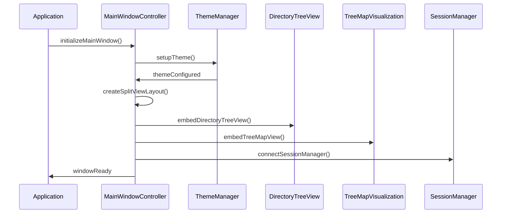
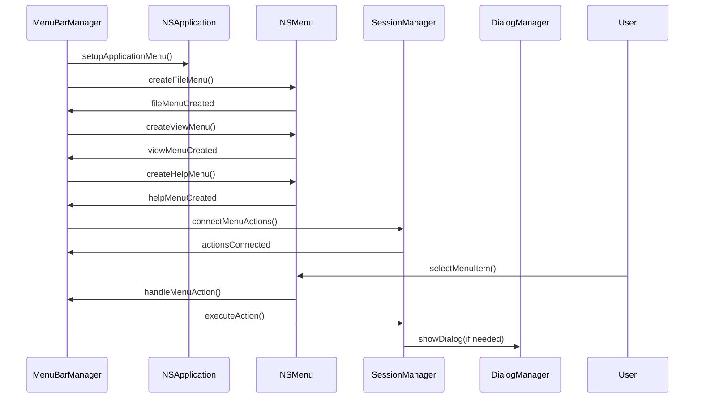
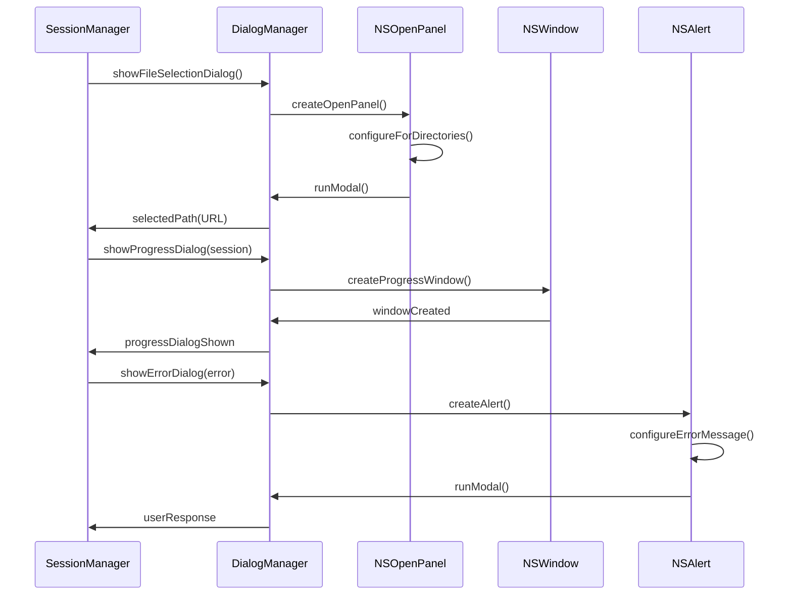
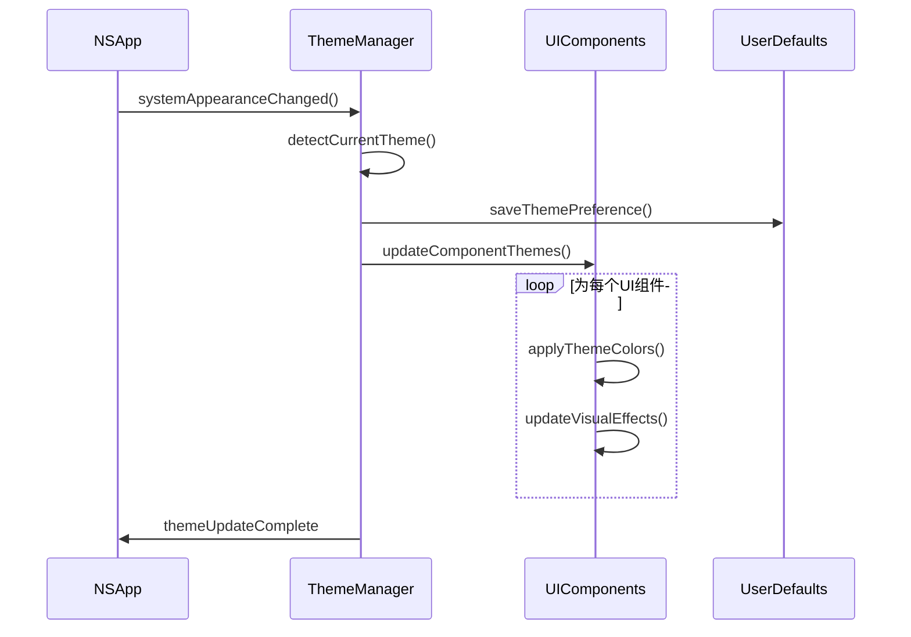
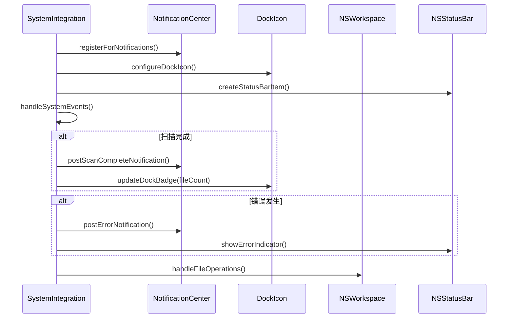

# 模块8：用户界面模块 (UserInterface) - 处理流程设计

## 模块概述

**模块名称：** UserInterface  
**对应需求特性：** 特性7 - 原生macOS用户界面  
**核心职责：** 实现符合macOS设计规范的原生图形用户界面，包括完整的主窗口布局、工具栏、目录树、TreeMap可视化区域、状态栏等，提供一致的用户体验和系统集成功能

## 界面架构设计

### 主窗口布局 (1200x800像素)

```
┌─────────────────────────────────────────────────────────────────┐
│ 🗂️ 选择文件夹 | ▶️ 开始扫描 | ⏹️ 停止 | 🔄 刷新 | ⚡ 进度条 | 📁 当前路径 │ <- 工具栏 (44px)
├─────────────────────────────────────────────────────────────────┤
│                    │                                            │
│   📁 目录树视图      │           🎨 TreeMap 可视化区域              │
│   ├─ 📁 Documents   │    ┌─────┐ ┌───┐ ┌─────────┐              │
│   │  ├─ 📄 file1    │    │     │ │   │ │         │              │
│   │  └─ 📄 file2    │    │ 大  │ │小 │ │   中等   │              │ <- 主内容区域
│   ├─ 📁 Downloads   │    │ 文  │ │文 │ │   文件   │              │
│   │  └─ 📄 file3    │    │ 件  │ │件 │ │         │              │
│   └─ 📁 Pictures    │    └─────┘ └───┘ └─────────┘              │
│                    │                                            │
├─────────────────────────────────────────────────────────────────┤
│ 📊 状态: 扫描中... | 📁 1,234 文件 | 💾 2.5 GB | ⚠️ 3 个错误      │ <- 状态栏 (24px)
└─────────────────────────────────────────────────────────────────┘
```

## 核心组件

### 1. MainWindowController - 主窗口控制器
**关键逻辑：** 管理主窗口的创建、布局和生命周期，实现完整的用户界面布局。协调工具栏、目录树、TreeMap和状态栏的交互，处理窗口状态的保存和恢复。

**实现步骤：**
- 使用NSSplitViewController创建左右分栏布局 (30%/70%)
- 创建NSToolbar工具栏，包含扫描控制按钮和进度显示
- 集成NSOutlineView目录树组件
- 集成TreeMap可视化组件
- 创建状态栏显示扫描状态和统计信息
- 实现组件间的数据绑定和事件处理

### 2. ToolbarManager - 工具栏管理器
**关键逻辑：** 管理工具栏的创建和状态更新，包含扫描控制按钮、进度指示器和当前路径显示。根据扫描状态动态更新按钮的可用性和进度显示。

**实现步骤：**
- 创建NSToolbar和NSToolbarItem组件
- 实现选择文件夹、开始扫描、停止扫描、刷新按钮
- 添加NSProgressIndicator进度指示器
- 添加当前扫描路径显示标签
- 实现按钮状态的动态更新逻辑

### 3. DirectoryTreePanel - 目录树面板
**关键逻辑：** 管理左侧目录树面板的显示和交互，使用NSOutlineView显示文件夹层级结构。支持实时更新、选择高亮和与TreeMap的联动。

**实现步骤：**
- 创建NSScrollView和NSOutlineView组件
- 实现NSOutlineViewDataSource和NSOutlineViewDelegate
- 集成DirectoryTreeView模块进行数据管理
- 实现选择变化的事件处理
- 添加文件夹大小和数量的显示

### 4. TreeMapPanel - TreeMap面板
**关键逻辑：** 管理右侧TreeMap可视化面板，显示文件和文件夹的矩形方块表示。支持鼠标交互、缩放导航和与目录树的联动。

**实现步骤：**
- 创建自定义NSView作为TreeMap容器
- 集成TreeMapVisualization模块进行布局计算
- 集成InteractionFeedback模块处理鼠标交互
- 实现方块的绘制和颜色编码
- 添加缩放和导航功能

### 5. StatusBarManager - 状态栏管理器
**关键逻辑：** 管理底部状态栏的显示，包括扫描状态、文件统计、错误信息和进度百分比。提供实时的状态更新和错误提示。

**实现步骤：**
- 创建NSView状态栏容器
- 添加状态文本、统计信息、错误计数显示
- 实现状态的实时更新机制
- 添加错误信息的点击查看功能

### 6. MenuBarManager - 菜单栏管理器
**关键逻辑：** 创建和管理符合macOS规范的应用程序菜单，动态更新菜单项的可用状态。处理菜单选择事件的路由和分发，支持快捷键绑定和最近使用项目的管理。

**实现步骤：**
- 使用NSMenu和NSMenuItem创建标准macOS菜单结构
- 实现菜单项的target-action模式，连接到相应的处理方法
- 使用validateMenuItem协议动态更新菜单项的启用状态
- 维护最近使用路径列表，动态更新"最近使用"子菜单

### 7. DialogManager - 对话框管理器
**关键逻辑：** 统一管理各种系统对话框的创建和显示，包括文件选择、进度显示和错误提示。处理对话框的模态状态和生命周期，确保用户体验的一致性和内存的及时释放。

**实现步骤：**
- 使用NSOpenPanel创建文件选择对话框，配置为目录选择模式
- 创建自定义NSWindow作为进度对话框，包含进度条和取消按钮
- 使用NSAlert创建标准化的错误提示对话框
- 实现对话框的内存管理，确保及时释放不使用的对话框

### 8. ThemeManager - 主题管理器
**关键逻辑：** 监听系统外观变化，自动切换深色/浅色模式。管理应用程序的颜色方案和视觉效果，确保所有UI组件的主题一致性，支持主题切换的平滑过渡动画。

**实现步骤：**
- 监听NSApp.effectiveAppearanceDidChangeNotification系统通知
- 定义深色和浅色模式的颜色集合，使用NSColor.controlAccentColor等系统颜色
- 实现主题切换时的批量UI更新，通知所有组件更新颜色
- 使用NSAnimationContext实现主题切换的平滑过渡动画

### 9. SystemIntegration - 系统集成器
**关键逻辑：** 集成macOS系统功能，包括通知中心、Dock图标和状态栏。处理文件系统操作和Finder集成，管理应用程序权限和系统服务的调用。

**实现步骤：**
- 使用NSUserNotificationCenter发送系统通知
- 更新NSApp.dockTile.badgeLabel显示扫描进度
- 集成NSWorkspace.shared.selectFile实现Finder显示功能
- 使用NSPasteboard.general实现路径复制到剪贴板
- 处理文件系统权限请求和错误处理

## 组件交互流程

### 扫描流程
1. 用户点击"选择文件夹" → DialogManager显示文件选择对话框
2. 用户选择文件夹后点击"开始扫描" → ToolbarManager更新按钮状态
3. 扫描开始 → StatusBarManager显示扫描状态
4. 扫描进行中 → DirectoryTreePanel实时更新目录树
5. 扫描进行中 → TreeMapPanel实时更新可视化
6. 扫描进行中 → ToolbarManager更新进度指示器
7. 扫描完成 → 所有组件更新为完成状态

### 交互流程
1. 用户在目录树中选择文件夹 → TreeMapPanel更新显示该文件夹内容
2. 用户在TreeMap中点击方块 → DirectoryTreePanel选中对应文件夹
3. 用户鼠标悬停在TreeMap方块 → 显示tooltip和高亮效果
4. 用户右键点击TreeMap方块 → 显示上下文菜单

## 依赖关系

- **依赖模块**: DirectoryTreeView, TreeMapVisualization, InteractionFeedback, SessionManager
- **被依赖模块**: 无 (顶层模块)
- 使用UNUserNotificationCenter发送系统通知
- 通过NSApp.dockTile更新Dock图标徽章和进度指示
- 使用NSWorkspace.shared实现"在Finder中显示"功能
- 集成NSStatusBar创建可选的状态栏项目

## 依赖关系

- **依赖模块**: DirectoryTreeView, TreeMapVisualization, SessionManager
- **被依赖模块**: 无 (顶层UI模块)

## 主要处理流程

### 流程1：主窗口初始化和布局管理流程



**详细步骤：**
1. **窗口创建和配置**
   - 创建符合macOS设计规范的主窗口
   - 设置窗口最小尺寸和默认尺寸
   - 配置窗口标题栏和工具栏
   - 启用窗口状态恢复功能

2. **主题系统初始化**
   - 检测系统深色/浅色模式
   - 配置应用程序颜色方案
   - 设置动态主题切换监听
   - 应用macOS标准视觉效果

3. **分栏布局创建**
   - 创建左右分栏的NSSplitView
   - 设置分栏比例和约束
   - 配置分栏器样式和行为
   - 实现响应式布局调整

4. **子视图嵌入**
   - 在左侧面板嵌入目录树视图
   - 在右侧面板嵌入TreeMap视图
   - 建立视图间的数据绑定
   - 配置视图更新回调

### 流程2：菜单栏和工具栏管理流程



**详细步骤：**
1. **应用程序菜单创建**
   - 创建标准的macOS应用程序菜单
   - 配置"关于"、"偏好设置"、"退出"等标准项
   - 设置菜单项的快捷键和图标
   - 实现菜单项的启用/禁用逻辑

2. **文件菜单管理**
   - "新建扫描"菜单项和快捷键
   - "打开历史会话"菜单项
   - "导出结果"功能菜单
   - 最近使用的扫描路径列表

3. **视图菜单管理**
   - 显示/隐藏侧边栏选项
   - TreeMap显示模式切换
   - 调试模式开关
   - 窗口缩放和全屏选项

4. **菜单动作处理**
   - 将菜单选择转发给相应的模块
   - 处理菜单项的状态更新
   - 管理菜单项的可用性
   - 提供用户反馈

### 流程3：对话框和文件选择器管理流程



**详细步骤：**
1. **文件选择对话框**
   - 创建原生的NSOpenPanel
   - 配置为只选择目录
   - 设置默认路径和标题
   - 处理用户选择结果

2. **进度对话框管理**
   - 创建模态进度窗口
   - 显示进度条和状态文本
   - 提供取消按钮功能
   - 实时更新进度信息

3. **错误对话框处理**
   - 创建标准的NSAlert
   - 根据错误类型设置图标和按钮
   - 格式化错误消息显示
   - 提供错误详情展开选项

4. **对话框生命周期**
   - 管理对话框的显示和隐藏
   - 处理对话框的内存释放
   - 维护对话框的模态状态
   - 确保用户体验一致性

### 流程4：主题和外观管理流程



**详细步骤：**
1. **主题检测和切换**
   - 监听系统外观变化通知
   - 检测当前深色/浅色模式
   - 保存用户主题偏好设置
   - 触发全局主题更新

2. **颜色方案管理**
   - 定义深色和浅色模式的颜色集
   - 管理语义化颜色 (背景、前景、强调色等)
   - 处理颜色的动态切换
   - 确保颜色对比度符合可访问性要求

3. **视觉效果应用**
   - 应用macOS标准的视觉效果
   - 配置窗口的毛玻璃效果
   - 设置控件的外观样式
   - 优化不同主题下的可读性

4. **组件主题更新**
   - 通知所有UI组件更新主题
   - 重新渲染需要更新的界面元素
   - 保持主题切换的流畅性
   - 处理主题切换的动画效果

### 流程5：系统集成和通知管理流程



**详细步骤：**
1. **系统通知集成**
   - 注册应用程序通知权限
   - 创建扫描完成通知
   - 处理用户点击通知的响应
   - 管理通知的显示时机

2. **Dock图标管理**
   - 设置应用程序Dock图标
   - 显示扫描进度徽章
   - 更新文件数量指示器
   - 处理Dock图标的右键菜单

3. **状态栏集成**
   - 创建可选的状态栏项目
   - 显示扫描状态指示器
   - 提供快速访问菜单
   - 管理状态栏项目的可见性

4. **文件系统集成**
   - 处理"在Finder中显示"操作
   - 支持拖拽文件夹到应用程序
   - 集成系统文件操作
   - 处理文件权限请求

## 性能优化策略

### 1. 界面响应性优化
- 使用异步更新避免UI阻塞
- 实现界面元素的延迟加载
- 优化重绘和布局计算
- 缓存频繁使用的UI资源

### 2. 内存管理优化
- 及时释放不使用的对话框
- 使用弱引用避免循环引用
- 优化图像和图标的内存占用
- 实现UI组件的对象池

### 3. 主题切换优化
- 缓存不同主题的颜色对象
- 使用批量更新减少重绘次数
- 优化主题切换的动画性能
- 预加载主题资源

### 4. 系统集成优化
- 异步处理系统通知
- 优化文件操作的响应时间
- 缓存系统状态查询结果
- 减少不必要的系统调用

## 接口定义

```swift
protocol UserInterfaceProtocol {
    // 窗口管理
    func showMainWindow()
    func hideMainWindow()
    func updateWindowTitle(_ title: String)
    func restoreWindowState()
    func saveWindowState()
    
    // 对话框管理
    func showFileSelectionDialog() -> URL?
    func showProgressDialog(for session: ScanSession)
    func hideProgressDialog()
    func showErrorDialog(_ error: AppError)
    func showPreferencesDialog()
    
    // 主题管理
    func getCurrentTheme() -> AppTheme
    func setTheme(_ theme: AppTheme)
    var themeChanged: Published<AppTheme> { get }
    
    // 系统集成
    func showInFinder(_ path: String)
    func postNotification(_ notification: AppNotification)
    func updateDockBadge(_ count: Int)
    
    // 状态管理
    var windowState: Published<WindowState> { get }
    var isMainWindowVisible: Bool { get }
}

protocol MainWindowControllerProtocol {
    func setupLayout()
    func embedChildViews()
    func handleWindowResize()
    func updateSplitViewRatio(_ ratio: CGFloat)
    
    var leftPanelView: NSView { get }
    var rightPanelView: NSView { get }
}

protocol DialogManagerProtocol {
    func createFileSelectionDialog() -> NSOpenPanel
    func createProgressDialog() -> NSWindow
    func createErrorDialog(_ error: AppError) -> NSAlert
    func showModal(_ dialog: NSWindow) -> NSApplication.ModalResponse
}

struct WindowState {
    let frame: CGRect
    let isVisible: Bool
    let isMinimized: Bool
    let splitViewRatio: CGFloat
}

enum AppTheme {
    case light
    case dark
    case auto
}

struct AppNotification {
    let title: String
    let message: String
    let type: NotificationType
}

enum NotificationType {
    case scanComplete
    case error
    case warning
    case info
}
```

## 测试策略

### 1. 界面测试
- 窗口创建和布局测试
- 菜单功能完整性测试
- 对话框交互测试
- 主题切换测试

### 2. 集成测试
- 与子模块的集成测试
- 系统通知功能测试
- 文件操作集成测试
- 多窗口管理测试

### 3. 用户体验测试
- 界面响应性测试
- 可访问性测试
- 不同屏幕尺寸适配测试
- 键盘导航测试

### 4. 兼容性测试
- 不同macOS版本兼容性
- 深色/浅色模式测试
- 多显示器环境测试
- 系统权限处理测试

## 监控指标

### 1. 性能指标
- 窗口创建时间
- 主题切换响应时间
- 对话框显示延迟
- 内存使用量

### 2. 用户体验指标
- 界面响应时间
- 动画流畅度
- 错误处理及时性
- 系统集成完整性

### 3. 稳定性指标
- 界面崩溃率
- 内存泄漏检测
- 资源释放完整性
- 异常处理覆盖率